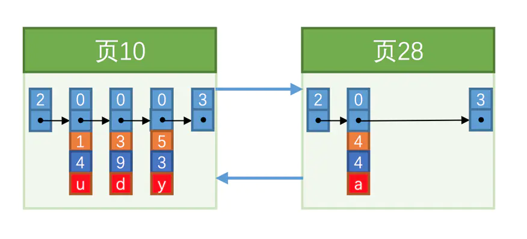

# 1. 索引介绍

​	你一定看到过这样的例子，索引是什么，你要查字典，不可能从第一页翻到最后一页去查找，你会先查找拼音或者偏旁部首，然后直接跳转到对应的页小范围的一条一条查找，这样会快得多。

 索引也是类似，建立索引就是按照某种规则建立一颗B+树，在B+树查询到符合要求的记录就类似于查询到拼音或者偏旁部首一样，最后回表就能很快的查找到完整具体的记录。

​	有一个数据表index_demo，如下

```mysql
CREATE TABLE index_demo (
	c1 INT,
    c2 INT,
    C3 CHAR(1),
    PRIMARY KEY(c1)
)charset=utf8mb4;
```

​	插入的每条记录的行格式，简化如下


* record_type：记录头信息的一项属性，表示记录的类型，0表示普通记录，1表示目录项记录，2表示Infimum记录(最小记录的上一条记录)，3表示Supremum记录(最大记录的下一条记录)。

* next_record：记录头信息的一项属性，表示下一条地址相对于本条记录的地址偏移量，为了方便大家理解，我们都会用箭头来表明下一条记录是谁。

* 各个列的值：这里只记录在index_demo表中的三个列，分别是c1、c2和c3。

* 其他信息：除了上述3种信息以外的所有信息，包括其他隐藏列的值以及记录的额外信息。

​	插入记录后，结构如下


# 2. 当插入记录，页中有什么变化？

假设每个数据页存放3条记录

向index_demo插入3条记录

变化如下：


记录组成了单链表，按照主键的值从小到大的顺序将记录排序，innodb要求这样存放

接下来再插入一条记录

innodb还要求，**下一个数据页**用户记录的主键值**大于上一个页**中用户记录的主键值，因为一个页已经存满了，所以新创建出一个页，进行关联



页号为什么不连续？因为链表新增结点都是随机分配一个空间，在内存上不连续

* 页分裂

不管对页中的记录是增加、删除还是修改，我们必须遵守"**下一个数据页**用户记录的主键值**大于上一个页**中用户记录的主键值"这个规则。为了维持这个规则，往往伴随记录的移动，甚至需要为记录分配新页，这个过程也叫**页分裂**。


假设往表中插入了很多条记录


查字典不可能从头开始一个个往后查，记录也是一样，不可能一条条顺序往后找，那么`innodb`是怎么做的呢？

那就是给这些记录一个目录！


开头就提到了的`record_type`属性，它的各个取值代表的意思如下：

0：普通的用户记录
1：目录项记录
2：`Infimum`记录
3：`Supremum`记录

目录项记录的`record_type`值是`1`，而普通用户记录的`record_type`值是`0`。

  目录项记录只有主键值和页的编号两个列，而普通的用户记录的列是用户自己定义的，可能包含很多列，另外还有`InnoDB`自己添加的隐藏列。

**innodb怎么查询？**

以查找主键为`8`的记录为例。

1. 先到存储目录项记录的页（页`30`）中通过二分法快速定位到用户记录页，因为`5< 8< 12`，所以定位到对应的记录所在的页就是页`28`。
2. 再到存储用户记录的页`28`中根据单链表遍历定位到主键值为`8`的用户记录。

**目录项比较多一页放不下怎么办？那就和用户记录一样进行页分裂。**

我们假设一个目录页最多存放`4`条目录项记录(真实情况是可以存放很多条)，如果此时再插入一条主键值为`320`的用户记录，那就需要再分配一个新的页去存放目录了。


从图中可以看出，我们插入了一条主键值为`320`的用户记录之后需要两个新的数据页：

1. 为存储该用户记录而新生成了页`31`。
2. 因为原先存储目录项记录的页`30`的容量已满（我们前边假设只能存储`4`条目录项记录），所以不得不需要一个新的页`32`来存放页`31`对应的目录项。

假如还是查找主键为8的记录，此时innodb该如何查询？

1. 确定目录项在哪个页。页30的目录项记录的主键值的范围是[1, 320)，页32表示的目录项记录的主键值范围[320, +∞)，显然主键值为8的记录在页30中。
2. 通过目录页确定用户记录页。因为5< 8< 12，所以用户记录在页28中。
3. 在真正用户记录页中定位到具体记录。这个就是单链表遍历即可。

如果表中的数据确实是很多，会产生很多存储目录项的页，那我们怎么根据主键值快速定位一个存储目录项记录的页呢？

那就是为这些存储目录的页再生成一个更高级的目录页，就像是一个多级目录一样。


```
有人做过这样一个计算，假如叶子结点代表的数据页可以存放100条用户记录，所有目录页可以存放1000条目录项记录，那么：
如果B+树只有1层，也就是只有1个用于存放用户记录的节点，最多能存放100条记录。
如果B+树有2层，最多能存放1000×100=100000条记录。
如果B+树有3层，最多能存放1000×1000×100=100000000条记录。
如果B+树有4层，最多能存放1000×1000×1000×100=100000000000条记录。（一千亿条记录）
一般都不会超过这个数字，也就是说B+树一般不超过4层，可以通过二分法快速定位记录，然后小范围遍历即可。
```

```
但实际开发中，一般单表数据不超过2000万
```

# 3. 聚集索引

刚刚上面几节所画的B+树全部都是按照聚集索引(主键值)排序的，可以说B+树本身就是一个索引。聚集索引有以下2个特点

1. 使用主键值大小进行记录和页的排序，都是按照主键值升序排列，记录之间是单链表结构，页与页之间是双链表结构。

2. B+树的叶子结点是完整的用户记录，也就是叶子结点存储了所有列的值(包括隐藏列)。

具有这2个特点的B+树称为聚集索引，聚集索引不需要显式使用INDEX语句创建，如下

```mysql
CREATE INDEX 索引名称 ON 表名(字段);
ALTER TABLE 表名 ADD INDEX 索引名称(字段);
```

`innodb`自动为我们创建聚集索引。

```
注意：
  有一个点很容易混淆，走PRIMARY索引和全表扫描有什么区别呢？他们其实都是在聚集索引上操作的（聚集索引B+树的叶子结点是根据主键排好序的完整的用户记录，包含表里的所有字段），区别就在于

  全表扫描将聚集索引B+树的叶子结点依次顺序扫描并判断条件，在以下几种情况会走全表扫描：

select * from demo_info这种无条件的查询语句
select * from demo_info where common_field != 'a'这种条件字段common_field没有建索引的情况
select * from demo_info order by key1 limit 10000, 1条件字段key1建了索引但是MySQL认为走二级索引的成本比全表扫描成本高的情况。

  PRIMARY索引是利用二分思想将聚集索引B+树到指定范围区间进行扫描，比如select * from demo_info where id in (1, 2)这种条件字段是主键id，可以很好的利用到索引进行二分的快速查询。
```

# 4. 非聚集索引(二级索引)

如果 `where` 条件并不是按照主键 `id` 去筛选条件，就会沿着链表依次遍历，浪费性能

方法：可以多建几颗`B+`树啊，不同的`B+`树可以采用不同的排序规则。比如刚刚的`index_demo` 表中的`c2`列的值的大小作为记录和页的排序规则，再建这样一个规则的`B+`树。

* **非聚集索引的特点**

1. `B+`树的叶子结点存储的不是完整的用户记录，没有全部列的信息，**只有`c2`列和主键列这两个列的值。**
2. 目录项记录不再是主键+页号，而是`c2`列+页号。
3. 使用记录`c2`列的大小进行记录和页的排序。不管是用户记录页还是目录页，都是按照`c2`列的大小升序排列的单链表结构。

**创建了非聚集索引后，现在想要查询where c2 = 4的记录的步骤如下：**

1. 确定第一条符合c2 = 4的目录项所在的页。
2. 确定第一条符合c2 = 4的用户记录所在的页。
3. 找到符合c2 = 4的第一条用户记录。找到该记录后，由于只存储了c2列和主键c1，所以需要根据该记录的主键信息到聚集索引中查找完整的用户记录（回表）。然后返回非聚集索引的叶子节点处，找到刚才定位到的符合条件的记录，继续往后扫描，因为c2列没有唯一键unique约束，可能满足c2 = 4的有多条记录，搜索完本页就跳到下一页第一条记录继续往后扫描，每找到一条满足的记录就进行一次回表操作，重复这个过程，直到下一条记录不满足c2 = 4为止。

```
注意：值为NULL的非聚集索引记录都会被放到B+树的最左边。在上图中，如果插入c2 = NULL的记录，那么该B+树叶子节点中，将会在c2 = 2记录的左边，因为MySQL认为NULL值是最小的。
```

# 5. 联合索引

​	我们也可以同时以多个列的大小作为排序规则，也就是同时为多个列建立索引，比如说我们想让`B+`树按照`c2`和`c3`列的大小进行排序，那么

1. 先把各个记录和页按照`c2`列进行排序。
2. 在记录的`c2`列相同的情况下，采用`c3`列进行排序

# 6. 索引覆盖

​	`explain`查询`sql`执行计划时，`Extra`显示`Using index`时，能够触发索引覆盖。**索引覆盖无需回表**，需要查询的字段已经都在该`B+`树上了。索引已经“覆盖了”我们的查询需求，所以称为覆盖索引。

# 7. 非聚集索引一定会查询多次吗？如何避免回表？

​	比如有一个联合索引`idx_c2_c3(c2, c3)`，`select c3 from 表名 where c2 = 4;`就只需要查询一次辅助索引就可以了，因为我需要查询的值正好是索引之一，一棵索引树上就能获取`SQL`所需的列数据（索引覆盖），无需回表，速度更快。

```
注意：当你建立c2, c3联合索引之后却看到Extra显示Using index condition; Using filesort，一般是使用了where c2 = "xx" order by c3 desc这样的形式，有人认为Using filesort就是因为c3需要order by才导致外部排序，实际上是你联合索引顺序建反了，index(c2, c3)错误的写成了index(c3, c2)，导致B+树优先按照c3排序，c3相同时，才按照c2排序，这样和写的sql意义不符合
```

# 8. MRR原理（Disk-Sweep Multi-Range Read）

​		每次根据主键回表时，虽然是按照非聚集索引排好序的，但是这些记录的主键id是无序的，也就是说，这些非聚集索引记录对应的聚集索引记录所在的页面也是无序的。每次回表都要重新定位页的位置，将聚集索引页读取出来，这些非连续I/O的性能开销很大。

  因为大多数的数据都是按照主键递增顺序插入得到的，所以我们可以认为，如果按照主键递增顺序查询的话，对磁盘的读比较接近顺序读，能够提升读性能。

  于是，便有了MRR(Disk-Sweep Multi-Range Read，多范围读取)的优化措施。即先读取一部分满足条件的非聚集索引记录，将它们的主键值排好序之后再统一回表，相比于每读取一条非聚集索引记录就回表，这样会节省一些I/O开销（比如记录更有可能在同一页）。

**MRR 优化的设计思路：**

1. 根据非聚集索引`a`，定位到满足条件的记录，将`id`值放入`read_rnd_buffer`中;
2. 将`read_rnd_buffer`中的`id`进行递增排序；
3. 排序后的`id`数组，依次到主键`id`索引中查记录，并作为结果返回。

​		这里read_rnd_buffer的大小是由read_rnd_buffer_size参数控制的 (运行show variables like 'read_rnd_buffer_size'查看大小，默认256K)。如果步骤1 中，read_rnd_buffer放满了，就会先执行完步骤2和3，然后清空read_rnd_buffer。之后继续找索引a的下个记录，并继续循环。

  按照官方文档的说法，计算成本的时候，会更倾向于不使用MRR，把mrr_cost_based设置为'off'(默认是'on')，就是固定使用MRR了。经过我的测试，如果按照非主键id排序，则无论如何不会使用MRR。

默认情况下，mrr_cost_based是on，查看sql执行计划如下。

```mysql
explain select * from demo_info where key2 between 124 and 135
```

​		MRR能够提升性能的核心在于，这条查询语句在索引上做的是一个范围查询，可以得到足够多的主键id。这样通过排序主键id以后，再去主键索引查数据，才能体现出“顺序性”的优势。

  我在之后的文章将会忽略这个概念，直接认为每读取一条非聚集索引记录就立即回表操作，但是不排除面试会问到这个问题，大家需要了解一下。

# 9. 普通索引和唯一索引，应该建立哪个？

普通索引和唯一索引都是非聚集索引

## 9.1 查询过程

​		假设执行查询的语句是 select id from table where t = 6，我们对t这个字段建立了索引。

* 对于普通索引来说，查找到满足条件的第一个记录后，需要查找下一个记录，直到碰到第一个不满足t=6条件的记录。
* 对于唯一索引来说，由于索引定义了唯一性，查找到第一个满足条件的记录后，就会停止继续检索。

​		`InnoDB`的数据是按数据页为单位来读写的。当需要读一条记录的时候，并不是将这条记录本身从磁盘读出来，而是以页为单位，将其整体读入内存。在`InnoDB`中，每个数据页的大小默认是`16KB`。

​		因为引擎是按页读写的，所以说，当找到t=6的记录的时候，它所在的数据页就都在内存里了。那么，对于普通索引来说，要多做的那一次“查找和判断下一条记录”的操作，就只需要一次指针寻找和一次计算。

  当然，如果t=6这个记录刚好是这个数据页的最后一个记录，那么要取下一个记录，必须读取下一个数据页，这个操作会稍微复杂一些，但也只是增加少量的IO成本，除非数据量极为巨大。

## 9.2 更新过程

​		先了解一下`change buffer`

​		当需要更新一个数据页时，如果数据页在内存中就直接更新，而如果这个数据页还没有在内存中的话，在不影响数据一致性的前提下，InnoDB会将这些更新操作缓存在change buffer中，这样就不需要从磁盘中读入这个数据页了。在下次查询需要访问这个数据页的时候，将数据页读入内存，然后执行change buffer中与这个页有关的操作。通过这种方式就能保证这个数据逻辑的正确性。

​		虽然名字叫作`change buffer`，实际上它是可以持久化的数据。也就是说，`change buffer`在内存中有拷贝，也会被写入到磁盘上。

​		将`change buffer`应用到旧的数据页，得到新的数据页的过程，称为`merge`。除此之外，系统有后台线程会定期`merge`。在数据库正常关闭（`shutdown`）的过程中，也会执行`merge`操作。

​		如果能够将更新操作先记录在`change buffer`，减少读磁盘，语句的执行速度会得到明显的提升。而且，数据读入内存是需要占用`buffer pool`的，所以这种方式还能够避免占用内存，提高内存利用率。

​		**那么什么条件下可以使用`change buffer`呢？**

​		对于唯一索引来说，所有的更新操作都要先判断这个操作是否违反唯一性约束。比如，要插入`t=7`这个记录，就要先判断现在表中是否已经存在`t=7`的记录，而这必须要将数据页读入内存才能判断。如果都已经读入到内存了，那直接更新内存会更快，就没必要使用`change buffer`了。

​		**因此，唯一索引的更新就不能使用`change buffer`，只有普通索引可以使用。**

如果要在这张表中插入一个新记录t=7的话，InnoDB的处理流程是怎样的。

  第一种情况是，这个记录要更新的目标页在内存中。这时，InnoDB的处理流程如下：

* 对于唯一索引来说，找到合适的位置，判断到没有冲突，插入这个值，语句执行结束；

* 对于普通索引来说，找到合适的位置，插入这个值，语句执行结束。

  这样看来，普通索引和唯一索引对更新语句性能影响的差别，只是一个判断，只会耗费微小的CPU成本。

  但这不是我们关注的重点。

  第二种情况是，这个记录要更新的目标页不在内存中。这时，InnoDB的处理流程如下：

* 对于唯一索引来说，需要将数据页读入内存，判断到没有冲突，插入这个值，语句执行结束；
* 对于普通索引来说，则是将更新记录在change buffer，语句执行就结束了。

  **将数据从磁盘读入内存涉及随机IO的访问，是数据库里面成本最高的操作之一。**change buffer因为减少了随机磁盘访问，所以对更新性能的提升是会很明显的。

  如果业务有大量插入数据的操作，where条件如果是唯一索引判断插入，会比普通索引有明显的阻塞感。

## 9.3 change buffer 的使用场景

​		通过上面的分析，大家知道了使用`change buffer`对更新过程的加速作用，也清楚了`change buffer`只限于用在普通索引的场景下，而不适用于唯一索引。那么，现在有一个问题就是：**普通索引的所有场景，使用`change buffer`都可以起到加速作用吗？**

​		因为merge的时候是真正进行数据更新的时刻，而change buffer的主要目的就是将记录的变更动作缓存下来，所以在一个数据页做merge之前，change buffer记录的变更越多（也就是这个页面上要更新的次数越多），收益就越大。

  因此对于写多读少的业务来说，页面在写完以后马上被访问到的概率比较小，此时change buffer的使用效果最好。这种业务模型常见的就是账单类、日志类的系统。

  反过来，假设一个业务的更新模式是写入之后马上会做查询，那么即使满足了条件，将更新先记录在change buffer，但之后由于马上要访问这个数据页，会立即触发merge过程。这样随机访问IO的次数不会减少，反而增加了change buffer的维护代价。对于这种业务模式来说，change buffer反而起到了副作用。
