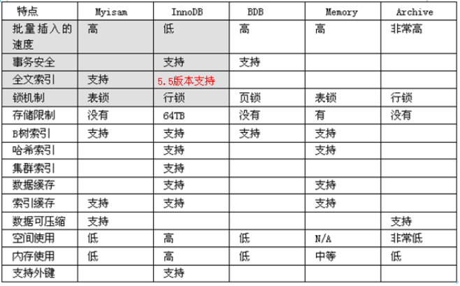
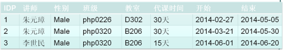
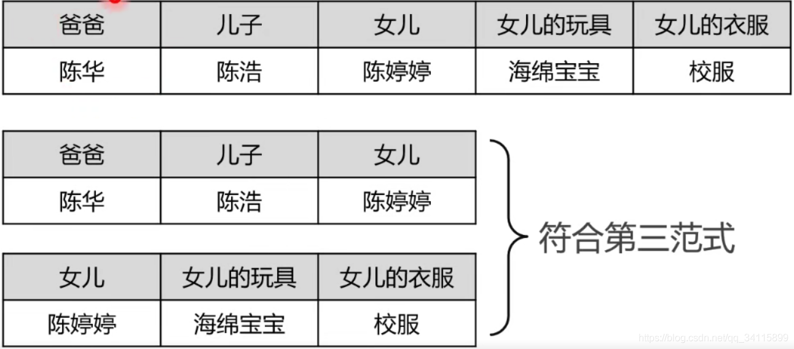
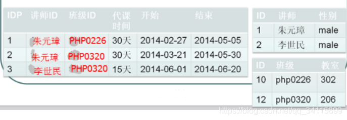
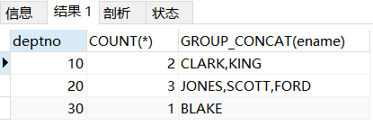
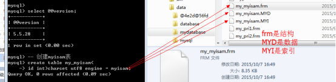
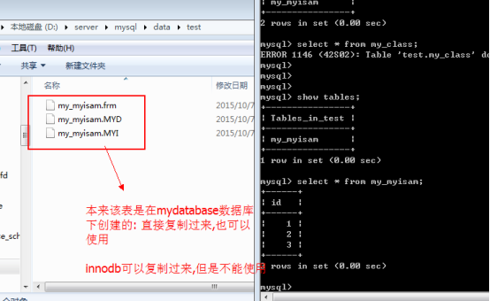
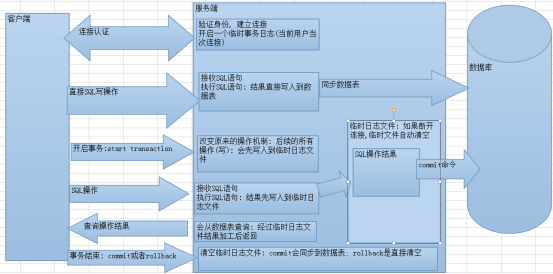
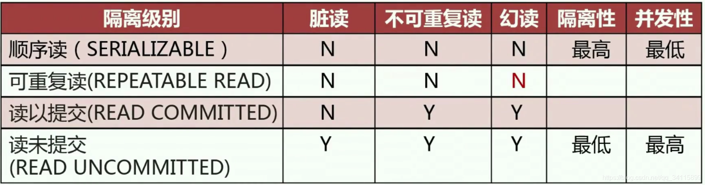

# 1. SQL语句

## 1.1 SQL分类

**数据定义语言：简称DDL(Data Definition Language)**，用来定义数据库对象：数据库，表，列等。关键字：create，alter，drop等

**数据操作语言：简称DML(Data Manipulation Language)**，用来对数据库中表的记录进行更新。关键字：insert，delete，update等

**数据控制语言：简称DCL(Data Control Language)**，用来定义数据库的访问权限和安全级别，及创建用户。

**数据查询语言：简称DQL(Data Query Language)**，用来查询数据库中表的记录。关键字：select，from，where等

## 1.2 常用数据类型

| 类型    | 描述                                               |
| ------- | -------------------------------------------------- |
| int     | 整形                                               |
| double  | 浮点型                                             |
| varchar | 字符串型                                           |
| date    | 日期类型，格式：yyyy-MM-dd，只有年月日，没有时分秒 |

注意：

1. BOOLEAN在数据库保存的是tinyInt类型，false为0，true为1

# 2. 索引

几乎所有的索引都是建立在字段之上.

索引: 系统根据某种算法, 将已有的数据(未来可能新增的数据),单独建立一个文件: 文件能够实现快速的匹配数据, 并且能够快速的找到对应表中的记录.

## 2.1 创建索引

```mysql
CREATE TABLE t_message(
	id INT UNSIGNED PRIMARY KEY,
	content VARCHAR(200) NOT NULL,
	type ENUM("公告", "通报", "个人通知") NOT NULL,
	create_time TIMESTAMP NOT NULL,
	INDEX idx_type (type)
);
```

## 2.2 添加索引

向已存在的表中添加索引的方式如下

**普通索引：**

CREATE INDEX 索引名称 ON 表名(字段);  /*添加索引方式1*/

ALTER TABLE 表名 ADD INDEX 索引名称(字段); /*添加索引方式2*/

**唯一索引：**

CREATE UNIQUE INDEX 索引名称 ON 表名(字段)

**联合索引：**

CREATE INDEX 索引名称 ON 表名(字段1，字段2...)
## 2.3 查询索引

```mysql
show index from t_message;
```

## 2.4 删除索引

```mysql
drop index idx_type on t_message;
```

## 2.5 索引的使用原则

1. 选择性高的列：对于具有大量唯一值或不重复值的列，索引能够极大地提高查询性能。这种情况下，索引可以帮助数据库快速定位所需数据

2. 经常用作过滤条件的列：对于经常用于 WHERE 子句、JOIN 条件或其他过滤条件的列，建立索引可以提高查询速度。

3. 排序和分组：如果某列经常用于 ORDER BY、GROUP BY 或其他排序和分组操作，为该列创建索引可以提高这些操作的性能。

4. 外键列：如果表之间有外键关系，在外键列上创建索引可以提高连接查询的性能。

5. 覆盖索引：尽量创建包含查询所需所有列的索引，这样查询可以直接在索引中获得所需数据，无需回表查询。这称为“覆盖索引”。

6. 索引维护成本：索引不仅会占用存储空间，还会在插入、更新和删除操作时产生额外的维护成本。因此，在创建索引时要权衡查询性能和维护成本。

7. 避免冗余索引：尽量避免创建重复或相似的索引。冗余索引不仅浪费存储空间，还会增加维护成本。可以定期审查索引并删除不必要的索引。

8. 低选择性列：对于具有较低选择性的列（即重复值较多的列），索引的效果可能不明显。在这种情况下，可以考虑使用其他查询优化方法。

9. 分析查询计划：分析查询计划，以确保数据库实际使用了预期的索引。如果没有使用预期索引，可以调整查询语句或调整索引策略。

10. 适时更新统计信息：统计信息对于数据库优化器选择正确索引至关重要。定期更新统计信息以确保数据库优化器作出正确的索引选择。


## 2.6 索引的意义

1. 提高查询速度：通过使用索引，数据库可以快速定位到需要的数据，而无需扫描整个表。这可以大大减少数据查询所需的时间和系统资源。
2. 优化排序和分组：索引可以帮助数据库在执行排序（ORDER BY）和分组（GROUP BY）操作时更高效地处理数据。
3. 加速连接操作：在具有外键关系的表之间进行连接查询时，索引可以显著提高查询性能。
4. 维护数据一致性：使用唯一索引可以确保表中的某列或某些列的唯一性，从而维护数据的完整性和一致性。
5. 改善查询计划：数据库查询优化器依赖于索引和统计信息来生成高效的查询计划。正确使用索引可以帮助查询优化器生成更好的查询计划，从而提高查询性能。

## 2.7 mysql 索引原理、B+树应用场景、索引优化、索引成本计算


# 5. 关系

## 5.1 一对一

一对一: 一张表的一条记录一定只能与另外一张表的一条记录进行对应; 反之亦然.

解决方案：

1. 将常用的和不常用的信息分离存储,分成两张表

2. 不常用信息表: 保证不常用信息与常用信息一定能够对应上: 找一个具有唯一性(确定记录)的字段来共同连接两张表

3. 一个常用表中的一条记录: 永远只能在一张不常用表中匹配一条记录;反过来,一个不常用表中的一条记录在常用表中也只能匹配一条记录: 一对一的关系

## 5.2 一对多

一对多: 一张表中有一条记录可以对应另外一张表中的多条记录; 但是返回过, 另外一张表的一条记录只能对应第一张表的一条记录. 这种关系就是一对多或者多对一.

解决方案: 

1. 在某一张表中增加一个字段,能够找到另外一张表的中记录: 应该在孩子表中增加一个字段指向妈妈表: 因为孩子表的记录只能匹配到一条妈妈表的记录.

## 5.3 多对多

多对多: 一张表中(A)的一条记录能够对应另外一张表(B)中的多条记录; 同时B表中的一条记录也能对应A表中的多条记录: 多对多的关系

解决方案: 

1. 在学生表中增加老师字段: 不管在哪张表中增加字段, 都会出现一个问题: 该字段要保存多个数据, 而且是与其他表有关系的字段, 不符合表设计规范: 增加一张新表: 专门维护两张表之间的关系
2. 增加中间表之后: 中间表与老师表形成了一对多的关系: 而且中间表是多表,维护了能够唯一找到一表的关系; 同样的,学生表与中间表也是一个一对多的关系: 一对多的关系可以匹配到关联表之间的数据.

# 6. 范式

范式: Normal Format, 是一种离散数学中的知识, 是为了解决一种数据的存储与优化的问题: 保存数据的存储之后, 凡是能够通过关系寻找出来的数据,坚决不再重复存储: 终极目标是为了减少数据的冗余.

范式: 是一种分层结构的规范, 分为六层: 每一次层都比上一层更加严格: 若要满足下一层范式,前提是满足上一层范式.

六层范式: 1NF,2NF,3NF...6NF, 1NF是最底层,要求最低;6NF最高层,最严格.

Mysql属于关系型数据库: 有空间浪费: 也是致力于节省存储空间: 与范式所有解决的问题不谋而合: 在设计数据库的时候, 会利用到范式来指导设计.

但是数据库不单是要解决空间问题,要保证效率问题: 范式只为解决空间问题, 所以数据库的设计又不可能完全按照范式的要求实现: 一般情况下,只有前三种范式需要满足.

范式在数据库的设计当中是有指导意义: 但是不是强制规范.

## 6.1 1NF

第一范式: 在设计表存储数据的时候, 如果表中设计的字段存储的数据,在取出来使用之前还需要额外的处理(拆分),那么说表的设计不满足第一范式。

第一范式要求字段的数据具有原子性: 不可再分.

第一范式是数据库的基本要求，不满足第一范式就不是关系型数据库

让我们简单化这个问题：

**1NF---原子性**

eg1:


## 6.2 2NF

第二范式: 在数据表设计的过程中,如果有复合主键(多字段主键), 且表中有字段并不是由整个主键来确定, 而是依赖主键中的某个字段(主键的部分): 存在字段依赖主键的部分的问题, 称之为部分依赖: 第二范式就是要解决表设计不允许出现部分依赖.

2NF---**唯一性**

数据表中的每条记录必须是唯一的。为了实现区分，通常要为表加上一个列来存储唯一标识，这个唯一属性列被称作主键列

eg1：

学号为230的学生在2018-07-15考试第一次58没及格，然后当天补考第二次还是58没及格，于是数据库就有了重复的数据。解决办法就是添加一个流水号，让数据变得唯一。


eg2：

讲师带课表



以上表中: 因为讲师没有办法作为独立主键, 需要结合班级才能作为主键(复合主键: 一个老师在一个班永远只带一个阶段的课): 代课时间,开始和结束字段都与当前的代课主键(讲师和班级): 但是性别并不依赖班级, 教室不依赖讲师: 性别只依赖讲师, 教室只依赖班级: 出现了性别和教室依赖主键中的一部分: 部分依赖.不符合第二范式.

解决方案1: 可以将性别与讲师单独成表, 班级与教室也单独成表.

解决方案2: 取消复合主键, 使用逻辑主键



ID = 讲师 + 班级(业务逻辑约束: 复合唯一键)

## 6.3 3NF

要满足第三范式,必须满足第二范式

第三范式: 理论上讲,应该一张表中的所有字段都应该直接依赖主键(逻辑主键: 代表的是业务主键), 如果表设计中存在一个字段, 并不直接依赖主键,而是通过某个非主键字段依赖,最终实现依赖主键: 把这种不是直接依赖主键,而是依赖非主键字段的依赖关系称之为传递依赖. 第三范式就是要解决传递依赖的问题.

3NF---**关联性**

每列都与主键有直接关系，不存在传递依赖

eg1：

根据主键爸爸能关联儿子女儿，但是女儿的玩具、衣服都不是依赖爸爸的，而是依赖女儿的，这些东西不是与爸爸有直接关系，所以拆分两个表。

儿子女儿依赖于爸爸，女儿的玩具、衣服依赖于女儿。



满足第三范式后，检索、提取数据非常方便，如果不满足，虽然表也能建成功，但是检索就会花费很多时间，比如如果是第一个表，逻辑上要找女儿的衣服，去查找女儿是找不到的，此时女儿不是主键。数据表拆分之后，根据主键列女儿陈婷婷，可以很快的找到女儿的衣服校服。主键查找是很快的。

依照第三范式，数据可以拆分到不同的数据表，彼此保持关联

## 6.4 逆规范化

有时候, 在设计表的时候,如果一张表中有几个字段是需要从另外的表中去获取信息. 理论上讲, 的确可以获取到想要的数据, 但是就是效率低一点. 会刻意的在某些表中,不去保存另外表的主键(逻辑主键), 而是直接保存想要的数据信息: 这样一来,在查询数据的时候, 一张表可以直接提供数据, 而不需要多表查询(效率低), 但是会导致数据冗余增加.

如讲师代课信息表



逆规范化: 磁盘利用率与效率的对抗

# 7. 数据高级操作

## 7.1 新增数据

Insert into 表名 [字段1,字段2,......] values (值1,值2,......); /*插入单条记录*/

Insert into 表名 [字段1,字段2,......] values (值1,值2,......), (值1,值2,......); /*插入多条记录*/

表名后面不写字段列表也可以插入数据，但是会影响速度。Mysql会进行词法分析，找到对应表结构，然后自动给你补上字段列表。所以表名后面不写字段列表，数据库难以高效的操作。

MySQL的INSERT语句还有一种方言语法

**INSERT INTO 表名 SET 字段1=值1, 字段2=值2......**

### 7.1.1 IGNORE关键字

IGNORE关键字只会插入数据库不存在的记录。比如主键冲突、唯一性冲突，数据库会报错，加上IGNORE之后数据库会忽略这条数据不会报错。

INSERT [IGNORE] INTO 表名 ......;

### 7.1.2 主键冲突

当主键存在冲突的时候(Duplicate key)，你可以添加ignore关键字选择忽略，数据库不会报错，但是确实非得添加这个记录怎么办呢？可以选择性的进行处理: **更新和替换**

**主键冲突：更新操作**

Insert into 表名[(字段列表:包含主键)] values(值列表) on duplicate key update 字段 = 新值; (这个语法sql单独执行没问题，在mybatis会报错，找不到你想要的参数)

要想兼容mysql和mybatis两者，这里强烈建议不要用等号赋值
Insert into 表名[(字段列表:包含主键)] values(值列表) on duplicate key update 字段 = values(字段);

主键冲突: **替换**

**Replace** into 表名 [(字段列表:包含主键)] values(值列表);

### 7.1.3 蠕虫复制

蠕虫复制: 从已有的数据中去获取数据,然后将数据又进行新增操作: 数据成倍的增加.

表创建高级操作: 从已有表创建新表(复制表结构)

Create table 表名 like 数据库.表名;

蠕虫复制: 先查出数据, 然后将查出的数据新增一遍

Insert into 表名[(字段列表)] select 字段列表/* from 数据表名;

蠕虫复制的意义

从已有表拷贝数据到新表中
可以迅速的让表中的数据膨胀到一定的数量级: 测试表的压力以及效率

## 7.2 更新数据

基本语法

**UPDATE [IGNORE] 表名 SET 字段1=值1, 字段2=值2, ......
[WHERE 条件1 ......]
[ORDER BY ......]
[LIMIT ......];**

eg1：把每个员工的编号和他上司的编号+1，用order by子句完成

```mysql
UPDATE t_emp SET empno=empno+1, mgr=mgr+1
ORDER BY empno DESC;
```

### 7.2.1 UPDATE语句中的内连接

因为相关子查询效率非常低，所以我们可以利用表连接的方式来改造UPDATE语句

**UPDATE 表1 JOIN 表2 ON 条件**
**SET 字段1=值1, 字段2=值2, ......;**

**引申出另一种写法**

**UPDATE 表1 JOIN 表2**
**SET 字段1=值1, 字段2=值2, ......**
**WHERE 条件;**

表连接的UPDATE语句可以修改多张表的记录

### 7.2.2 UPDATE语句中的外连接

基本语法

**UPDATE 表1 [LEFT | RIGHT] JOIN 表2 ON 条件
SET 字段1=值1, 字段2=值2, ......;**

## 7.3 删除数据

基本语法

**DELETE [IGNORE] FROM 表名
[WHERE 条件1, 条件2, ...]
[ORDER BY ...]
[LIMIT ...];**

**子句执行顺序：FROM -> WHERE -> ORDER BY -> LIMIT -> DELETE**

## 7.3.1 DELETE语句中的内连接

因为相关子查询的效率非常低，所以我们可以利用表连接的方式来改造DELETE语句

**DELETE 表1, ... FROM 表1 JOIN 表2 ON 条件
[WHERE 条件1, 条件2, ...]
[ORDER BY ...]
[LIMIT ...];**

### 7.3.2 DELETE语句中的外连接

基本语法

**DELETE 表1, ... FROM 表1 [LEFT | RIGHT] JOIN 表2 ON 条件
[WHERE 条件1, 条件2, ...]
[ORDER BY ...]
[LIMIT ...]**

### 7.3.3 快速删除数据表全部记录

DELETE语句是在事务机制下删除记录，删除记录之前，先把要删除的记录保存到日志文件里，然后再删除记录。

TRUNCATE语句在事务机制之外删除记录，速度远超过DELETE语句。

语法

**TRUNCATE TABLE 表名;**

**注意：**

1. **drop（drop table 表名）是完全删除表，包括表结构，数据库就查不到这个表了**
2. **delete（delete from 表名）是删除表数据，保留表的结构，数据库中该表还存在，如果加where条件，可以只删除一行或者多行，下次插入id不会从1开始，而是从最后一次插入的id+1开始**
3. **truncate （truncate table 表名）只能删除全表数据，会保留表结构，数据库中该表还存在，下次插入id从1开始**

**如果要永久删除表，应该怎么做？**

**只能drop table 表名，用delete和truncate都不行。**

## 7.4 查询数据

完整语法

Select [字段别名]/* from 数据源 [where条件子句] [group by子句] [having子句] [order by子句] [limit 子句];

### 7.4.1 Select语句

最基本的查询语句就是SELECT和FROM关键字组成，SELECT语句屏蔽了物理层的操作，用户不必关系数据的真实存储，交互由数据库高效的查询数据。

All或者*: 默认保留所有的结果

Distinct: 去重, 查出来的结果,将重复给去除(所有字段都相同)

### 7.4.2 去重查询

语法格式

SELECT DISTINCT 字段 FROM 表名;

假如我们查询员工职业，执行如下语句

**注意点：**

**1.distinct关键字只能在select子句中使用一次**

**2.distinct关键字只能写在select子句的第一个字段前面，否则报错，若有多个字段，则只有多个字段的值都相同的情况才会被认为是重复记录，distinct才会生效**

### 7.4.3 字段别名

字段别名: 当数据进行查询出来的时候, 有时候名字并不一定就满足需求(多表查询的时候, 会有同名字段). 需要对字段名进行重命名: 别名

语法

字段名 [as] 别名;

**小细节：查询语句的执行顺序是先词法分析与优化，读取SQL语句，然后FROM子句选择数据来源，最后SELECT子句选择输出内容**

### 7.4.4 数据源

数据源: 数据的来源, 关系型数据库的来源都是数据表。本质上只要保证数据类似二维表，最终都可以作为数据源。

数据源分为多种: 单表数据源, 多表数据源, 查询语句

单表数据源: select * from 表名;

多表数据源: select* from 表名1,表名2...;

从一张表中取出一条记录，去另外一张表中匹配所有记录，而且全部保留(记录数和字段数)，将这种结果称为笛卡尔积(交叉连接)，笛卡尔积没什么用，所以应该尽量避免。只要没有条件，查询多表就会产生笛卡尔积。

**子查询: 数据的来源是一条查询语句(查询语句的结果是二维表)**

**Select * from (select 语句) as 表名;**

### 7.4.5 Where子句

Where子句: 用来判断数据,筛选数据.

Where子句返回结果: 0或者1, 0代表false,1代表true.

语法格式

SELECT ... FROM ... WHERE 条件 [AND | OR] 条件 ......;

判断条件:

比较运算符: >, <, >=, <= ,!= ,<>, =, like, between and, in/not in

逻辑运算符: &&(and), ||(or), !(not)

**where语句使用的注意事项：**

       WHERE子句中，条件执行的顺序是从左到右的。所以我们应该把索引条件或者筛选掉记录最多的条件写在最左侧。因为索引查询速度快，筛选记录最多的条件更容易触发短路语句的效果，这样就无须执行后续条件就能完成查询。

**小提示：子句的执行顺序是FROM -> WHERE -> SELECT -> ORDER BY -> LIMIT，先选择数据来源，再进行条件筛选，根据筛选完的记录选择输出内容，接着进行排序，最后选择显示的限定条件**

### 7.4.6 聚合函数

聚合函数在数据查询分析中，应用十分广泛。聚合函数可以对数据求和、求最大值和最小值、求平均值等等。

比如SQL提供了如下聚合函数

**Count(): 统计分组后的记录数: 每一组有多少记录**

**Max(): 统计每组中非空的最大值**

**Min(): 统计非空的最小值**

**Avg(): 统计平均值**

**Sum(): 统计和**

* **avg()函数：**

**eg：**比如求公司员工平均月收入是多少？

```mysql
SELECT AVG(sal + IFNULL(COMM,0)) AS avg FROM t_emp;
```

这里sal是月收入，comm是佣金。avg()只用来统计数字，不要去统计别的东西

* **max()函数：**

**eg1：**查询10和20部门中，月收入最高的员工？

```mysql
SELECT MAX(sal+IFNULL(comm,0)) FROM t_emp
WHERE deptno IN(10,20);
```

**eg2：**查询员工名字最长的是几个字符？

```mysql
SELECT MAX(LENGTH(ename)) FROM t_emp;
```

提示：LENGTH()可以统计字符个数

* **min()函数用法和max()一样**

* **count()函数**

count(*)用于获得包含**空值**的记录数，count(列名)用于获得包含**非空值**的记录数

```mysql
SELECT COUNT(*), COUNT(comm) FROM t_emp;
```

**几乎所有的聚合函数都会忽略空值(null)，除了count(数字)、count(*)。**

count(*)、count(1)包括了所有的列，相当于行数，在统计结果的时候，不会忽略列值为NULL。

count(列名)只包括列名那一列，在统计结果的时候，会忽略列值为空。

### 7.4.7 Group by 子句

为什么要分组呢？因为默认情况下汇总函数是对全表范围内的数据做统计。

Group by:主要用来分组查询, 通过一定的规则将一个数据集划分为若干个小的区域，然后针对每个小区域分别进行数据汇总处理。也就是根据某个字段进行分组(相同的放一组,不同的分到不同的组)

基本语法: group  by 字段名;

eg：根据不同的部门号分组显示平均工资

```mysql
SELECT deptno, ROUND(AVG(sal)) FROM t_emp GROUP BY deptno;
/*round四舍五入为整数*/
```

**逐级分组**

数据库支持多列分组条件，执行的时候逐级分组

eg：查询每个部门里，每种职位的人员数量和平均底薪

```mysql
SELECT deptno, job, COUNT(*), AVG(sal)
FROM t_emp
GROUP BY deptno, job
ORDER BY deptno;
```

如果查询语句中含有GROUP BY子句，那么SELECT子句中的内容必须遵守如下约定：

​    **SELECT子句中可以包含聚合函数或者GROUP BY子句的分组列**，**其余列出现在SELECT子句中时就涉及到了SQL经典问题。**

​	在MySQL中，如果在SELECT列表中包含GROUP BY子句中未指定的列，MySQL 的默认行为不会报错，但结果可能不确定，MySQL将使用默认值FIRST()来选择这些列的值。也就是说，刚刚的例子假如是GROUP BY deptno，没有job，虽然语法不报错，但是这个job列的值实际上是从符合GROUP BY条件的行中任意选择的，也就是说，deptno为10，查出来的job可能是CLERK、MANAGER、PRESIDENT中任何一个，MySQL会默认选择job列在分组集合中的第一个值作为代表值。

**什么情况下查询除了group by以外的非聚合字段时有意义？**

  当非聚合字段与group by字段具有一对一关系的时候，这么写就有意义。在这个例子中group by deptno，但是一个deptno里面有很多个job，这么写没有业务意义。但是如果是一对一的关系，比如剧本是否点赞和剧本详细信息在2张表中，现在要查询点赞数最高的3个剧本详细信息，如下：

```mysql
# drama_operation记录不同的人点赞的记录
# drama_info记录这个剧本的详细信息,剧本id都是唯一的
 
select
    di.id,
    di.title,
    di.content,
    COUNT(do.drama_id) AS num_likes
from
    drama_info di
join drama_operation do on di.id = do.drama_id
where do.is_like = 1
group by
    do.drama_id
order by
    num_likes DESC
limit 3;
 
# 根据剧本id关联，虽然根据剧本id分组，查询了除了group by字段以外的非聚合字段，但是因为剧本id和这些非聚合字段是一对一的关系，所以这里在业务意义上也不会出错。
```

**对分组结果集再次做汇总计算(回溯统计)**

​	这里就是WITH ROLLUP的使用

```mysql
SELECT deptno, AVG(sal), SUM(sal), MAX(sal), MIN(sal), COUNT(*)
FROM t_emp
GROUP BY deptno WITH ROLLUP
```

使用了WITH ROLLUP之后，你发现最底下还有一行，对应列再次做聚合计算，avg列再次做平均值计算，sum列对上面几个部门数据再次进行sum计算...

**GROUP_CONCAT函数**

​    这个函数可以把分组查询中的某个字段拼接成一个字符串

eg：查询每个部门内底薪超过2000元的人数和员工姓名

```mysql
SELECT deptno, COUNT(*), GROUP_CONCAT(ename)
FROM t_emp
WHERE sal >= 2000
GROUP BY deptno;
```



**小提示：语句的执行顺序如下：**

**FROM -> WHERE -> GROUP BY -> SELECT -> ORDER BY -> LIMIT**

**FROM 选择数据来源，WHERE选择条件，符合条件的记录留下来，然后经过GROUP BY分组，分完组根据SELECT子句里面聚合函数做计算，然后ORDER BY对结果集排序，最后交给LIMIT挑选返回哪些分页的数据显示。**

### 7.4.8 Having 子句

Having子句与where子句一样是进行条件判断的.

有同学会问了，和where子句功能一样，那还有什么用，多此一举？

eg1：查询部门平均底薪超过2000的员工数量，你是不是会这样写？

```mysql
SELECT deptno, COUNT(*)
FROM t_emp
WHERE AVG(sal) >= 2000
GROUP BY deptno;
```

结果运行出错，我们前面也说了，**WHERE子句不允许出现聚合函数**。而且WHERE优先级高于GROUP BY，在条件筛选的时候不知道按照什么范围去筛选，是全部数据筛选还是分部门数据筛选呢？

解决方案来了，那就是HAVING子句，**HAVING子句的出现主要是为了WHERE子句不能使用聚合函数的问题**，HAVING子句不能独立存在，必须依赖于GROUP BY子句而存在，GROUP BY 执行完成就立即执行HAVING子句

```mysql
SELECT deptno, COUNT(*)
FROM t_emp
GROUP BY deptno HAVING AVG(sal) >= 2000;
```

**HAVING子句的特殊用法**

如果按照数字1分组，MySQL会按照SELECT子句中的列进行分组，HAVING子句也可以正常使用

比如按照部门分组，查询各个部门总人数

```mysql
SELECT deptno, COUNT(*) FROM t_emp GROUP BY 1;
```

**WHERE不能用别名，是进入到内存操作**

### 7.4.9 Order by子句

Order by: 排序, 根据某个字段进行升序或者降序排序, 依赖校对集.

使用基本语法

**单字段排序：**

Order by 字段名 [asc|desc]; -- asc是升序(默认的),desc是降序

**多字段排序:**

使用order by 规定首要条件和次要条件排序。数据库会先按照首要条件排序，遇到首要排序内容相同的记录，那么会启用次要条件再次排序。

**小提示：**

1.order by 写在 limit前面

2.**子句的执行顺序是FROM -> SELECT -> ORDER BY -> LIMIT，先选择数据来源，再选择输出内容，接着进行排序，最后选择显示的限定条件**

### 7.4.10 Limit子句

Limit子句是一种限制结果的语句，用来做数据分页的。

比如我们看朋友圈，只会加载少量的部分信息，不会一次性加载全部朋友圈，那样只会浪费CPU时间、内存、网络带宽。而结果集的记录可能很多，可以使用limit关键字限定结果集数量。

**Limit有两种使用方式**

**方案1: 只用来限制长度(数据量): limit 数据量;**
**方案2: 限制起始位置,限制数量: limit 起始位置,长度;**

Limit方案2主要用来实现数据的分页: 为用户节省时间,提交服务器的响应效率, 减少资源的浪费.

**小提示：子句的执行顺序 FROM -> SELECT -> LIMIT，先选择数据来源，再选择输出内容，最后选择显示的限定条件**

### 7.4.11 select语句中各关键字的先后顺序
(1) from 
(2) on
(3) join
(4) where （可以使用表的别名）
(5) group by(可以开始使用select中字段的别名（不是表的别名），后面的语句中都可以使用)
(6) having + 聚合函数
(7) select 
(8) distinct 
(9) order by
(10) limit 

1~3是table部分——形成表

4~6是filter部分——过滤条件

7~10是show部分——展示

# 8. 连接查询

连接查询: 将多张表(可以大于2张)进行记录的连接(按照某个指定的条件进行数据拼接): 最终结果是: 记录数有可能变化, 字段数一定会增加(至少两张表的合并)

连接查询的意义: 在用户查看数据的时候,需要显示的数据来自多张表.

连接查询: join, 使用方式: 左表 join 右表

左表: 在join关键字左边的表

右表: 在join关键字右边的表

## 8.1 连接查询分类

SQL中将连接查询分成四类: 内连接,外连接,自然连接和交叉连接

## 8.2 交叉连接

交叉连接: cross join, 从一张表中循环取出每一条记录, 每条记录都去另外一张表的所有记录逐个进行匹配，并保留所有记录，最终形成的结果叫做笛卡尔积.


       交叉连接也称为笛卡尔积连接，它返回两个表中所有可能的行组合。交叉连接通常在实际应用中很少使用，因为它会产生大量的结果，可能导致性能问题。然而，在某些特殊情况下，交叉连接可能是有用的。

基本语法: 左表 [cross] join 右表。其中cross可以省略，交叉连接是一个隐式的内连接，内连接没写条件就是交叉连接。

交叉连接存在的价值: 保证连接这种结构的完整性，生成所有可能组合，为查询提供基础数据。

## 8.3 内连接

内连接: [inner] join, 内连接是最常用的连接类型，它返回两个表中具有匹配值的行。如果某行在一个表中没有匹配值，那么结果集中将不包含这行。内连接可以使用`INNER JOIN`关键字或在`WHERE`子句中指定连接条件来实现。

```mysql
SELECT ...
FROM table1
[INNER] JOIN table2 ON table1.column = table2.column
[WHERE] ...
```

* SELECT ... 是你要选择的列，可以使用 table1.column 或 table2.column 的形式，或使用 * 选择所有列。
* FROM table1 是主表。
* INNER JOIN table2 是要连接的表。内连接仅返回两个表中满足连接条件的匹配记录。
* ON table1.column = table2.column 是连接条件，即用于比较两个表中的列以建立连接的条件。
* WHERE ... 是筛选条件，如果你不需要筛选结果集，可以省略 WHERE 子句。

多种形式

```mysql
SELECT ... FROM 表1 JOIN 表2 ON 连接条件;
SELECT ... FROM 表1 JOIN 表2 WHERE 连接条件;
SELECT ... FROM 表1, 表2 WHERE 连接条件;
```

## 8.4 外连接

外连接分为两种：左(外)连接和右(外)连接。

左外连接就是保留左表所有记录，与右表做连接。如果右表有符合条件的记录就与左表连接。如果右表没有符合条件的记录，就用NULL与左表连接。右连接也是如此。

基本语法：

```mysql
SELECT ...
FROM table1
LEFT JOIN table2 ON table1.column = table2.column
[WHERE] ...
 
或者
 
SELECT ...
FROM table1
RIGHT JOIN table2 ON table1.column = table2.column
[WHERE] ...
```

* SELECT ... 是你要选择的列，可以使用 table1.column 或 table2.column 的形式，或使用 * 选择所有列。
* FROM table1 是主表。
* LEFT JOIN table2 或 RIGHT JOIN table2 是要连接的表。左连接（Left Join）返回主表中的所有记录，即使在连接表中没有匹配的记录。右连接（Right Join）返回连接表中的所有记录，即使在主表中没有匹配的记录。
* ON table1.column = table2.column 是连接条件，即用于比较两个表中的列以建立连接的条件。
* WHERE ... 是筛选条件，如果你不需要筛选结果集，可以省略 WHERE 子句。

为什么要有外连接？

如果有一名临时员工，没有固定的部门编号，那么我们查询每名员工和他的部门名称，用内连接就会漏掉临时员工，所以要引入外连接语法才能解决这个问题。外连接与内连接的区别在于，除了符合条件的记录之外，结果集中还会保留不符合条件的记录。

**外连接的注意事项：**

内连接只保留符合条件的记录，所以查询条件写在ON子句和WHERE子句中的效果是相同的。但是外连接里，条件写在WHERE子句里，不符合条件的记录是会被过滤掉的，而不是保留下来。

## 8.5 自然连接

自然连接: natural join, 自然连接（NATURAL JOIN）是一种基于具有相同名称的列自动执行连接操作的方法。它有自然内连接（NATURAL INNER JOIN）和自然外连接（NATURAL OUTER JOIN）两种形式。

自然连接: 可以分为自然内连接和自然外连接.

## 8.6 子查询

子查询: sub query, 查询是在某个查询结果之上进行的.(一条select查询的sql语句内部包含了另外一条select查询的sql语句).

### 8.6.1 子查询分类

**Where子查询:** 子查询出现where条件中，where语句里**不推荐**使用子查询，每执行一次where条件筛选，就会进行一次子查询，效率低下。像这种反复子查询就属于**相关子查询**，where语句的子查询都属于相关子查询，我们要避免相关子查询的存在。

**From子查询:** 子查询跟在from之后，通常这种子查询的结果集作为一个临时表，from子查询只会执行一次，不是相关子查询，所以查询效率高。

**SELECT子查询，**子查询跟在SELECT之后，SELECT子查询也是相关子查询，**不推荐**

### 8.6.2 单行子查询和多行子查询

单行子查询的结果集只有一条记录，多行子查询结果集有多行记录

多行子查询只能出现在WHERE子句和FROM子句中

### 8.6.3 WHERE子句中的多行子查询

WHERE子句中，可以用IN、ALL、ANY、EXISTS关键字来处理多行表达式结果集的条件判断。

### 8.6.4 子查询的EXISTS关键字

EXISTS关键字是把原来在子查询之外的条件判断，写到了子查询的里面。

SELECT ... FROM 表名 WHERE [NOT] EXISTS (子查询)

# 9. 视图

# 10. 数据备份与还原

数据备份还原的方式有很多种: 数据表备份, 单表数据备份, SQL备份, 增量备份.

## 10.1 数据表备份

不需要通过SQL来备份: 直接进入到数据库文件夹复制对应的表结构以及数据文件, 以后还原的时候,直接将备份的内容放进去即可.

数据表备份有前提条件: 根据不同的存储引擎有不同的区别.

存储引擎: mysql进行数据存储的方式: 主要是两种: innodb和myisam(免费)


对比myisam和innodb: 数据存储方式

Innodb: 只有表结构,数据全部存储到ibdata1文件中

Myisam: 表,数据和索引全部单独分开存储



这种文件备份通常适用于myisam存储引擎: 直接复制三个文件即可, 然后直接放到对应的数据库下即可以使用.



## 10.2 单表数据备份

每次只能备份一张表; 只能备份数据(表结构不能备份)

**如果业务数据非常多，建议只导出表结构，然后用SELECT INTO OUTFILE把数据导出成文本文档，具体操作可以看10.5节图形化操作。**

备份: 从表中选出一部分数据保存到外部的文件中(outfile)

Select */字段列表 into outfile 文件所在路径 from 数据源; -- 前提: 外部文件不存在

## 10.3 SQL备份与还原

**备份的是SQL语句:** 系统会对表结构以及数据进行处理,变成对应的SQL语句, 然后进行备份: 还原的时候只要执行SQL指令即可.(主要就是针对表结构)

**备份: mysql没有提供备份指令: 需要利用mysql提供的软件:** mysqldump.exe

Mysqldump.exe也是一种客户端,需要操作服务器: 必须连接认证

Mysqldump/mysqldump.exe -hPup 数据库名字 [数据表名字1[ 数据表名字2...]] > 外部文件目录(建议使用.sql)

mysqldump用来把业务数据导出成SQL文件，其中也包括了表结构

**mysqldump -uroot -p [no-data] 逻辑库 > 路径**

不写no-data表示既包含表结构，又包含数据

**SQL还原数据: 两种方式还原**

方案1: 使用mysql.exe客户端还原

Mysql.exe/mysql -hPup 数据库名字 < 备份文件目录

方案2: 使用SQL指令还原

1.use选择数据库； 2.Source 备份文件所在路径;

**SQL备份优缺点**

优点: 可以备份结构
缺点: 会浪费空间(额外的增加SQL指令)

## 10.4 增量备份

不是针对数据或者SQL指令进行备份: 是针对mysql服务器的日志文件进行备份

增量备份: 指定时间段开始进行备份., 备份数据不会重复, 而且所有的操作都会备份(大项目都用增量备份)

## 10.5 大文件备份与还原

业务数据比较多的时候，只导出表结构到sql文件，业务数据文件导出到txt文件，这样就跳过了sql词法分析和语法优化，哪怕导入几千万条数据，也可以在1分钟内导入完毕

# 11. 事务安全

事务: transaction, 一系列要发生的连续的操作

事务安全: 一种保护连续操作同时满足(实现)的一种机制

事务安全的意义: 保证数据操作的完整性

如果SQL语句直接操作文件是很危险的，比如你要给员工涨工资，正在update操作的时候，系统断电了，你就不知道谁已经涨了谁还没涨。

我们应该利用日志来间接写入。

MySQL总共5种日志，其中只有redo日志和undo日志与事务有关

日志就相当于数据文件的一个副本，SQL语句操作什么样的记录，MySQL就会把这些记录拷贝到undo日志，然后增删改查的操作就会记录到redo日志，最后把redo日志和数据库文件进行同步就行了。即使同步过程中断电了，有了redo日志的存在，重启MySQL数据库之后继续同步数据，同步成功后我们修改的数据就真正同步到数据库里面了，有事务的数据库抵抗风险的能力变强了。

RDBMS=SQL语句+事务(ACID)

事务是一个或者多个SQL语句组成的整体，要么全部执行成功，要么全部失败。

## 11.1 事务操作

事务操作分为两种: 自动事务(默认的), 手动事务

默认情况下，MySQL执行每条SQL语句都会自动开启和提交事务。为了让多条SQL语句纳入到一个事物之下，可以手动管理事务。

**START TRANSACTION;**

**SQL语句**

**[COMMIT | ROLLBACK];**

```mysql
START TRANSACTION;
 
DELETE FROM t_emp;
DELETE FROM t_dept;
SELECT * FROM t_emp;
SELECT * FROM t_dept;
```

开启事务: 告诉系统以下所有的操作(写)不要直接写入到数据表, 先存放到redo日志。

删除员工表t_emp和部门表t_dept之后，**SQL语句查询两表的的数据均为空**

但是去看**数据表的数据却仍然存在**，这是为什么呢？

因为你开启了事务，你现在的操作还在redo日志里面，并没有同步到数据库文件里面，你只有COMMIT之后才会同步

继续执行COMMIT

去数据表查看，2张数据表都被清空了。

当然你也可以直接回滚，执行ROLLBACK；

这样你的redo日志被清空，下次操作的时候重新往redo日志里面进行操作，就不会受到上一次操作的影响。

## 11.2 自动事务处理

在mysql中: 默认的都是自动事务处理, 用户操作完会立即同步到数据表中.

自动事务: 系统通过autocommit变量控制

关闭自动提交: set autocommit = off/0;

注意: 通常都会使用自动事务

## 11.3 事务原理

事务操作原理: 事务开启之后, 所有的操作都会临时保存到事务日志, 事务日志只有在得到commit命令才会同步到数据表,其他任何情况都会清空(rollback, 断电, 断开连接)



## 11.4 回滚点

回滚点: 在某个成功的操作完成之后, 后续的操作有可能成功有可能失败, 但是不管成功还是失败,前面操作都已经成功: 可以在当前成功的位置, 设置一个点: 可以供后续失败操作返回到该位置, 而不是返回所有操作, 这个点称之为回滚点.

设置回滚点语法: savepoint 回滚点名字;

## 11.5 事务ACID属性

**A: Atomic原子性**，一个事物中的所有操作要么全部完成，要么全部失败。事物执行后，不允许停留在中间某个状态。

**C: Consistency一致性**，不管在任何给定的时间，并发事务有多少，事务必须保证运行结果的一致性。事务可以并发执行，但是最终MySQL却串行执行。

怎么保证一致性？

阻止事务之间相互读取临时数据

**I: Isolation隔离性**，每个事务只能看到事务内的相关数据，别的事务的临时数据在当前事务是看不到的。隔离性要求事务不受其他并发事务的影响，在给定时间内，该事务是数据库运行的唯一事务。

**如果事务没有隔离性，按照不受控制的顺序并发读取和修改数据，想像一下会出现哪些问题？**

**一、脏读：**一个事务读取了第二个事物未提交的数据，当第二个事务回滚了数据之后，第一个事务就读取到了**无效**的数据。

如下图，事务1查询course_id=59的平均分score为9.2，而事务2此时将其平均分修改为9.6，当事务1再次读取的时候，平均分就变成了9.6，此时事务2回滚，事务1就是读取的**无效数据，简称脏读。**

**二、不可重复读：**一个事物前后两次读取的同一数据不一致。

如下图，事务1查询course_id=59的平均分score为9.6，而事务2此时将其平均分修改为9.7，并将修改提交，当事务1再次读取的时候，平均分就变成了9.7，事务1就是读取的错误数据，注意，不可重复读和脏读的区别就是，脏读的数据会回滚，不可重复读会把数据提交，脏读的数据是无效的，而不可重复读因为事务2的提交，数据是有效的。

**三、幻读**：指一个事务两次查询的结果集记录数不一致

如下图，事务1查询到平均分在9.5到9.8之间的记录数是2条，经过事务2对course_id=43的平均分修改，导致事务1第二次查询的记录数为3条，这种情况就叫幻读，幻读的数据最终也是有效的数据。

**怎么保证隔离性？**

 

**D: Durability持久性，事务一旦提交，结果便是永久性的。即便发生宕机，仍然可依靠事务日志完成数据持久化。**

锁机制: innodb默认是行锁, 但是如果在事务操作的过程中, 没有使用到索引,那么系统会自动全表检索数据, 自动升级为表锁

行锁: 只有当前行被锁住, 别的用户不能操作

表锁: 整张表被锁住, 别的用户都不能操作

## 11.6 事务的隔离级别

在某些特定场合，我们又想让事务之间读取到一些临时数据，这就需要修改事务的隔离级别


### 11.6.1 read uncommitted 读取未提交

场景一：比如买票的场景，逢年过节都需要买票回家，假如A和B都在买同一辆车的车票，此时还剩最后一张票，A点击购买，但是还没付款提交，因为查看不到事务之间的临时数据，所以B查看时，也还剩一张票，于是B点击购买，立即付款提交，结果A就会购买失败。所以理想的情况应该是，当A点击购买去付款时，B应该看得到这个临时数据，显示没有票才对。这种场景会出现脏读、幻读、不可重复读情况，隔离性最低，并发性最高。

```mysql
SET SESSION TRANSACTION ISOLATION LEVEL READ UNCOMMITTED;
```

### 11.6.2 read committed 读取已提交

场景二：银行转账的场景，A事务执行往Scott账户转账1000的操作，B事务执行扣除Scott账户100块的操作，如果A能读取到B事务未提交的数据，那么转账后就会修改为5900，而此时因为各种原因需要回滚支出100元的这个操作，此时账户就只有5900块了，凭空消失100块，所以只有A事务读取到B事务提交后的数据才能保证转账的正确性。这种场景就和买票的场景完全不同。这种场景是会出现幻读和不可重复读的。

```mysql
SET SESSION TRANSACTION ISOLATION LEVEL READ COMMITTED;
```

### 11.6.3 repeatable read 可重复度

场景三：你在淘宝或者京东等电商，点击购买，选好收货地址之类的之后，点击提交订单，就会让你输入支付密码支付，此时显示的价格是undo日志的价格，如果此时卖家涨价，你购买的还是涨价之前的价格，这种场景就是可重复读。可重复读不会出现脏读、不可重复读的情况，因为事务1读取不到事务2对数据的修改。对于幻读，只有靠锁或者serializable隔离级别下才能保证不出现幻读的问题。在应用中，你可以考虑使用Redis分布式锁在java层面杜绝幻读的可能。

```mysql
SET SESSION TRANSACTION ISOLATION LEVEL REPEATABLE READ;
```

**注意：MySQL默认事务隔离级别就是REPEATABLE READ**

### 11.6.4 serializable 可串行化

由于事务并发执行所带来的各种问题，前三种隔离级别只适用于在某种业务场景中，凡事序列化的隔离性，让事务逐一执行，就不会产生上述问题了。但是序列化的隔离级别使用的特别少，它让事务的并发性大大降低。可重复读不会出现幻读、脏读、不可重复读的情况，因为事务1读取不到事务2对数据的修改。隔离性最高，并发性最低，其实就是没有并发，所有事务按照顺序执行。

```mysql
SET SESSION TRANSACTION ISOLATION LEVEL SERIALIZABLE;
```



# 12. 触发器

# 13. 函数

# 14. 存储过程

存储过程简称过程,procedure, 是一种用来处理数据的方式.

存储过程是一种没有返回值的函数.