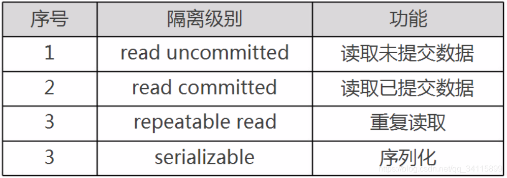

# 1. SQL语句

## 1.1 SQL分类

**数据定义语言：简称DDL(Data Definition Language)**，用来定义数据库对象：数据库，表，列等。关键字：create，alter，drop等

**数据操作语言：简称DML(Data Manipulation Language)**，用来对数据库中表的记录进行更新。关键字：insert，delete，update等

**数据控制语言：简称DCL(Data Control Language)**，用来定义数据库的访问权限和安全级别，及创建用户。

**数据查询语言：简称DQL(Data Query Language)**，用来查询数据库中表的记录。关键字：select，from，where等

## 1.2 常用数据类型

| 类型    | 描述                                               |
| ------- | -------------------------------------------------- |
| int     | 整形                                               |
| double  | 浮点型                                             |
| varchar | 字符串型                                           |
| date    | 日期类型，格式：yyyy-MM-dd，只有年月日，没有时分秒 |

注意：

1. BOOLEAN在数据库保存的是tinyInt类型，false为0，true为1

# 2. 索引

几乎所有的索引都是建立在字段之上.

索引: 系统根据某种算法, 将已有的数据(未来可能新增的数据),单独建立一个文件: 文件能够实现快速的匹配数据, 并且能够快速的找到对应表中的记录.

## 2.1 创建索引

```mysql
CREATE TABLE t_message(
	id INT UNSIGNED PRIMARY KEY,
	content VARCHAR(200) NOT NULL,
	type ENUM("公告", "通报", "个人通知") NOT NULL,
	create_time TIMESTAMP NOT NULL,
	INDEX idx_type (type)
);
```

## 2.2 添加索引

向已存在的表中添加索引的方式如下

**普通索引：**

CREATE INDEX 索引名称 ON 表名(字段);  /*添加索引方式1*/

ALTER TABLE 表名 ADD INDEX 索引名称(字段); /*添加索引方式2*/

**唯一索引：**

CREATE UNIQUE INDEX 索引名称 ON 表名(字段)

**联合索引：**

CREATE INDEX 索引名称 ON 表名(字段1，字段2...)
## 2.3 查询索引

```mysql
show index from t_message;
```

## 2.4 删除索引

```mysql
drop index idx_type on t_message;
```

## 2.5 索引的使用原则

1. 选择性高的列：对于具有大量唯一值或不重复值的列，索引能够极大地提高查询性能。这种情况下，索引可以帮助数据库快速定位所需数据

2. 经常用作过滤条件的列：对于经常用于 WHERE 子句、JOIN 条件或其他过滤条件的列，建立索引可以提高查询速度。

3. 排序和分组：如果某列经常用于 ORDER BY、GROUP BY 或其他排序和分组操作，为该列创建索引可以提高这些操作的性能。

4. 外键列：如果表之间有外键关系，在外键列上创建索引可以提高连接查询的性能。

5. 覆盖索引：尽量创建包含查询所需所有列的索引，这样查询可以直接在索引中获得所需数据，无需回表查询。这称为“覆盖索引”。

6. 索引维护成本：索引不仅会占用存储空间，还会在插入、更新和删除操作时产生额外的维护成本。因此，在创建索引时要权衡查询性能和维护成本。

7. 避免冗余索引：尽量避免创建重复或相似的索引。冗余索引不仅浪费存储空间，还会增加维护成本。可以定期审查索引并删除不必要的索引。

8. 低选择性列：对于具有较低选择性的列（即重复值较多的列），索引的效果可能不明显。在这种情况下，可以考虑使用其他查询优化方法。

9. 分析查询计划：分析查询计划，以确保数据库实际使用了预期的索引。如果没有使用预期索引，可以调整查询语句或调整索引策略。

10. 适时更新统计信息：统计信息对于数据库优化器选择正确索引至关重要。定期更新统计信息以确保数据库优化器作出正确的索引选择。


## 2.6 索引的意义

1. 提高查询速度：通过使用索引，数据库可以快速定位到需要的数据，而无需扫描整个表。这可以大大减少数据查询所需的时间和系统资源。
2. 优化排序和分组：索引可以帮助数据库在执行排序（ORDER BY）和分组（GROUP BY）操作时更高效地处理数据。
3. 加速连接操作：在具有外键关系的表之间进行连接查询时，索引可以显著提高查询性能。
4. 维护数据一致性：使用唯一索引可以确保表中的某列或某些列的唯一性，从而维护数据的完整性和一致性。
5. 改善查询计划：数据库查询优化器依赖于索引和统计信息来生成高效的查询计划。正确使用索引可以帮助查询优化器生成更好的查询计划，从而提高查询性能。

## 2.7 mysql 索引原理、B+树应用场景、索引优化、索引成本计算


# 5. 关系

## 5.1 一对一

一对一: 一张表的一条记录一定只能与另外一张表的一条记录进行对应; 反之亦然.

解决方案：

1. 将常用的和不常用的信息分离存储,分成两张表

2. 不常用信息表: 保证不常用信息与常用信息一定能够对应上: 找一个具有唯一性(确定记录)的字段来共同连接两张表

3. 一个常用表中的一条记录: 永远只能在一张不常用表中匹配一条记录;反过来,一个不常用表中的一条记录在常用表中也只能匹配一条记录: 一对一的关系

## 5.2 一对多

一对多: 一张表中有一条记录可以对应另外一张表中的多条记录; 但是返回过, 另外一张表的一条记录只能对应第一张表的一条记录. 这种关系就是一对多或者多对一.

解决方案: 

1. 在某一张表中增加一个字段,能够找到另外一张表的中记录: 应该在孩子表中增加一个字段指向妈妈表: 因为孩子表的记录只能匹配到一条妈妈表的记录.

## 5.3 多对多

多对多: 一张表中(A)的一条记录能够对应另外一张表(B)中的多条记录; 同时B表中的一条记录也能对应A表中的多条记录: 多对多的关系

解决方案: 

1. 在学生表中增加老师字段: 不管在哪张表中增加字段, 都会出现一个问题: 该字段要保存多个数据, 而且是与其他表有关系的字段, 不符合表设计规范: 增加一张新表: 专门维护两张表之间的关系
2. 增加中间表之后: 中间表与老师表形成了一对多的关系: 而且中间表是多表,维护了能够唯一找到一表的关系; 同样的,学生表与中间表也是一个一对多的关系: 一对多的关系可以匹配到关联表之间的数据.

# 6. 范式

范式: Normal Format, 是一种离散数学中的知识, 是为了解决一种数据的存储与优化的问题: 保存数据的存储之后, 凡是能够通过关系寻找出来的数据,坚决不再重复存储: 终极目标是为了减少数据的冗余.

范式: 是一种分层结构的规范, 分为六层: 每一次层都比上一层更加严格: 若要满足下一层范式,前提是满足上一层范式.

六层范式: 1NF,2NF,3NF...6NF, 1NF是最底层,要求最低;6NF最高层,最严格.

Mysql属于关系型数据库: 有空间浪费: 也是致力于节省存储空间: 与范式所有解决的问题不谋而合: 在设计数据库的时候, 会利用到范式来指导设计.

但是数据库不单是要解决空间问题,要保证效率问题: 范式只为解决空间问题, 所以数据库的设计又不可能完全按照范式的要求实现: 一般情况下,只有前三种范式需要满足.

范式在数据库的设计当中是有指导意义: 但是不是强制规范.

## 6.1 1NF

第一范式: 在设计表存储数据的时候, 如果表中设计的字段存储的数据,在取出来使用之前还需要额外的处理(拆分),那么说表的设计不满足第一范式。

第一范式要求字段的数据具有原子性: 不可再分.

第一范式是数据库的基本要求，不满足第一范式就不是关系型数据库

让我们简单化这个问题：

**1NF---原子性**

eg1:

