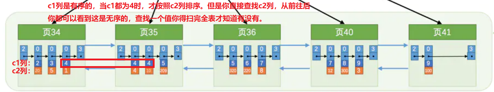
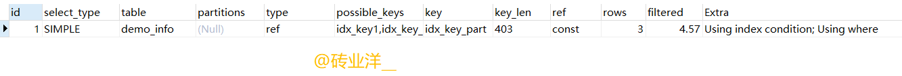
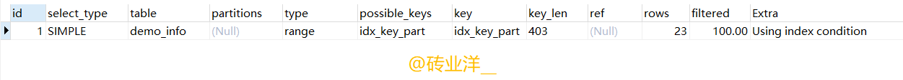
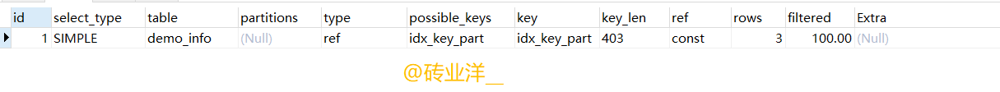

# 一、用到的数据表

```mysql
CREATE TABLE demo_info(
    id INT NOT NULL auto_increment,
    key1 VARCHAR(100),
    key2 INT,
    key3 VARCHAR(100),
    key_part1 VARCHAR(100),
    key_part2 VARCHAR(100),
    key_part3 VARCHAR(100),
    common_field VARCHAR(100),
    PRIMARY KEY (id),
    KEY idx_key1 (key1),
    UNIQUE KEY uk_key2 (key2),
    KEY  idx_key3 (key3),
    KEY idx_key_part(key_part1, key_part2, key_part3)
)ENGINE = INNODB CHARSET=utf8mb4;
```

​		看看那些加了索引

# 二、全值匹配

​		如果我们的搜索条件中的列和索引列对应的话（列的字段和个数要相同），这种情况就称为全值匹配

```mysql
SELECT * FROM demo_info WHERE key_part_1 = 'a' AND key_part_2 = 'b' AND key_part_3 = 'c';
```

`		WHERE`子句中的几个搜索条件的顺序对查询结果有啥影响么？也就是说如果我们调换`key_part_1`、`key_part_2`、`key_part_3`这几个搜索列的顺序对查询的执行过程有影响么？比方说写成下边这样

```mysql
SELECT * FROM demo_info WHERE key_part_2 = 'b' AND key_part_3 = 'c' AND key_part_1 = 'a';
```

​		答案是没有影响。**只要你把联合索引的每个索引列都用到了，随意更换顺序是没有影响的，查询优化器会自动调整。** 但是如果没有全部用到，那么就必须按照最左前缀原则使用。

# 三、最左前缀原则

​		在我们的搜索语句中也可以不用包含全部联合索引中的列，只包含左边的就行，比方说下边的查询语句：

```mysql
SELECT * FROM demo_info WHERE key_part_1 = 'a';
// 或者包含多个左边的列也行
SELECT * FROM demo_info WHERE key_part_1 = 'a' AND key_part_2 = 'b';
```

为什么搜索条件中必须出现左边的列才可以使用到这个`B+`树索引呢？

​		因为`B+`树的数据页和记录先是按照`key_part_1` 列的值排序的，在`key_part_1` 列的值相同的情况下才使用`key_part_2`列进行排序，也就是说`key_part_1` 列的值不同的记录中，`key_part_2` 的值可能是无序的。



# 四、匹配列的前缀（比如like 'a%'）

like操作符比较特殊，只有在匹配完整的字符串或者字符前缀时才产生合适的扫描区间。

比较字符串的大小其实就相当于依次比较每个字符的大小。字符串的比较过程如下:

1. 先比较字符串的第一个字符，第一个字符小的那个字符串就比较小。
2. 如果两个字符串的第一个字符相同，再比较第二个字符，第二个字符比较小那个字符串就比较小，以此类推。

​		如果这个列是索引列，那么字符串前缀相同的记录在单链表中肯定是相邻的。比如搜索条件为key1 LIKE 'a%'，对于非聚集索引来说，所有字符串前缀为'a'的记录肯定是相邻的。所以我们只要沿着单链表往后扫描即可，直到字符串前缀不为'a'为止。
​		所以，key1 LIKE 'a%'的扫描区间相当于['a', 'b')

# 五、匹配列的中间字符或者后缀（比如like '%a%', like '%com'）

如果查询中间包含的某个字符串，比如

```mysql
SELECT * FROM demo_info WHERE name LIKE '%a%';
```

`MySQL`就无法快速定位记录位置了，因为字符串中间有`'a'`的字符串并没有排好序，所以只能全表扫描了。

**如果查询后缀包含某个字符串，你会怎么做呢？**

​		可以把后缀查询改写成前缀查询，不过我们就得把表中的数据全部逆序存储一下，这样再查找以com为后缀的网址时搜索条件便可以这么写：WHERE url LIKE 'moc%'，这样就可以用到索引了。这样即使是千万上亿级别的数据量，也可以快速查找而不是全表扫描。如果要查看正确的url，只需要将此逆序一下就可以了。

# 六、匹配范围查找，确定扫描区间和边界

并不是所有的搜索条件都可以成为边界条件的，如下

```mysql
select * from demo_info where key1 < 'a' and key3 > 'z' and common_field = 'abc';
```

​		key1和key3但是单独的索引列，不是联合索引。

  如果使用idx_key1执行查询，那么相应的扫描区间是(-∞, 'a')，非聚集索引的叶子结点上只有key1和id，所以key3 > 'z' and common_field = 'abc'就是普通的搜索条件，这些普通的搜索条件是回表获得完整的用户记录后才判断它们是否成立。

  如果使用idx_key3执行查询，那么相应的扫描区间是('z', +∞)，而key1 < 'a' and common_field = 'abc'就是普通的搜索条件，这些普通的搜索条件是回表获得完整的用户记录后才判断它们是否成立。

# 七、IS NULL、IS NOT NULL、!=、BETWEEN、IN等等不能用索引吗？

结论：对于B+树索引来说，只要索引列使用了=、<=>、IN、NOT IN、IS NULL、IS NOT NULL、>、<、>=、<=、BETWEEN、!=（也就是<>）或者LIKE（只能是'a%'前缀字符形式）操作符连接起来，就可以使用到索引，如果你发现没走索引，请检查自己的结果集是否过多，限制一下结果集数量。
# 八、隐式转换导致全表扫描不走索引

比如，你明明想利用索引查询`key1='1'`的记录

```mysql
SELECT * FROM demo_info WHERE key1 = '1';
```

​		结果！你却写成了`key1 = 1`;这个`1`可是`number`类型，不是`varchar`了，当字段类型和查询条件数据类型不一致的时候，如果没有函数转换，则会隐式转换，如果不能隐式转换则报错。这里`varchar`的`'1'`可以顺利转换`number`类型的`1`，结果转换了类型，所以用不到索引。

​		注意: Server层包括连接器、查询缓存（MySQL 8.0剔除）、分析器、优化器、执行器等，涵盖MySQL的大多数核心服务功能，以及所有的内置函数（如日期、时间、数学和加密函数等），所有跨存储引擎的功能都在这一层实现。

  而非聚集索引的查询和回表是在存储引擎层，如果要用函数判断，必须等到把完整记录返回给Server层，这里隐式转换用到函数就在Server层，在Server层就用不到索引了，所以是全表扫描。

# 九、使用联合索引的场景

**eg1：**

```mysql
SELECT * FROM demo_info WHERE key_part1 = 'a' and key_part2 = 'b';
```

​		对于这个联合索引，先按照key_part1排序，在key_part1列的值相等的情况下再按照key_part2列进行排序，所以符合key_part1 = 'a' and key_part2 = 'b'条件的非聚集索引记录一定是相邻的。

  我们可以定位到符合key_part1 = 'a' and key_part2 = 'b'条件的第一条记录，然后回表，接着定位满足key_part1 = 'a' and key_part2 = 'b'的第二条记录，然后回表，就这样沿着记录所在的单链表往后扫描，直到不满足key_part1 = 'a' 或者key_part2 = 'b'条件为止。（每找到一条满足条件的记录都会进行回表操作）

**eg2:**

```mysql
SELECT * FROM demo_info WHERE key_part2 = 'a';
```

​		非聚集索引不是按照`key_part2`的值进行排序的。无法通过`key_part2 = 'a'`这个条件来减少扫描的记录数量，只能全表扫描，不会使用 `idx_key_part`这个联合索引。

# 十、索引条件下推（Index Condition Pushdown，简称ICP）

1. **索引下推表象理解：**		

​		联合索引idx_key_part(key_part_1, key_part_2, key_part_3)的联合索引，只有在key_part_2列相等的情况下，key_part3列才是升序的

​		由于非聚集索引idx_key_part是先按照key_part1来排序的，但是仅仅在key_part1相同的情况下，key_part3却可能是无序的，如上图。这样的话，这个联合索引就只能使用到key_part1这个索引列了，在['a', 'a']区间内的所有非聚集索引的记录进行依次扫描。

  这里例子需要注意！有人说是先找到key_part1 = 'a'的第一条记录，然后回表获得完整的用户记录之后，接着判断key_part3='c'是否成立。每找到一条满足key_part1 = 'a'条件的记录都会进行回表操作，回表后再判断key_part3='c'是否成立。**其实不对！**

  在使用idx_key_part联合索引执行查询时，虽然不能直接用到key_part3，但是还是**包含key_part3列的**。因此每当从idx_key_part索引的扫描区间['a', 'a']中获取到一条非聚集索引记录时，我们可以先判断这条二级索引记录是否符合key_part3='c'条件。如果符合该条件再执行回表操作，不符合就不回表，然后跳到下一条非聚集索引记录继续上述判断。**这样可能减少因回表操作而带来的性能损耗，这种优化方式称为索引条件下推（Index Condition Pushdown，简称ICP）。**

  虽然只能用到联合索引的一部分，利用后面的条件可以判断是否继续回表，从而加快查找速度。**索引条件下推的特性是在MySQL 5.6中引入的，该特性是默认开启的。**

2. **索引下推在存储引擎层和server层深入分析**

```mysql
explain SELECT * FROM demo_info WHERE key_part_1 = 'a' AND key_part_3 = 'c' AND key_part_1 < 'b';
```



​		`MySQL`分为`server`层和存储引擎层，`server`层和存储引擎层的交互是以记录为单位的。

1. server层第一次开始执行查询，把条件key_part1 = 'a'交给存储引擎，让存储引擎定位符合条件的第一条记录
2. 存储引擎在非聚集索引idx_key_part中定位key_part1 = 'a'的第一条记录，我们看到explain语句的输出结果的Extra列有一个Using index condition的提示，这表明会将有关idx_key_part非聚集索引的查询条件放在存储引擎层判断，这个特性就是所谓的索引条件下推。很显然这里的ICP条件就是key_part3 = 'c'。ICP条件筛选后得到一条非聚集索引记录，根据这条记录的主键id去回表，把回表得到的这条完整的用户记录返回给server层

```
注意：筛选到一条非聚集索引记录后就去回表，而不是把所有满足条件的非聚集索引记录都拿到后去回表
```

3. 我们的执行计划输出的`Extra`列有一个`Using Where`的提示，意味着`server`层在接收到存储引擎层返回的一条记录之后，接着就要判断其余的`where`条件是否成立（就是再判断一下`key1 < 'b'`是否成立）。如果成立的话，就直接发送给客户端，否则就跳过该条记录。

```
发现一条记录符合条件就发送给客户端，客户端在接收完全部的记录之后再展示！
```

4. 接着server层向存储引擎层要求继续读刚才那条记录的下一条记录。
5. 每条记录的头信息中都有next_record的这个属性，所以可以快速定位到下一条记录的位置，然后继续判断ICP条件，接着回表，存储引擎把下一条完整的记录取出后就将其返回给server层。
6. 然后重复第3步的过程，直到存储引擎层遇到了不符合key_part1 = 'a'的记录，然后向server层返回了读取完毕的信息，这时server层将结束查询。

3.  **范围查找也会使用到Using index condition，需要注意**

```mysql
explain select * from demo_info where key_part1 <= 'a' limit 1;
```



范围查询改成等值查询后

```mysql
explain select * from demo_info where key_part1 = 'a' limit 1;
```



因为在`InnoDB`存储引擎层有特殊的处理方案，是不作为`ICP`条件进行处理的，所以不会用到`Using index condition`。