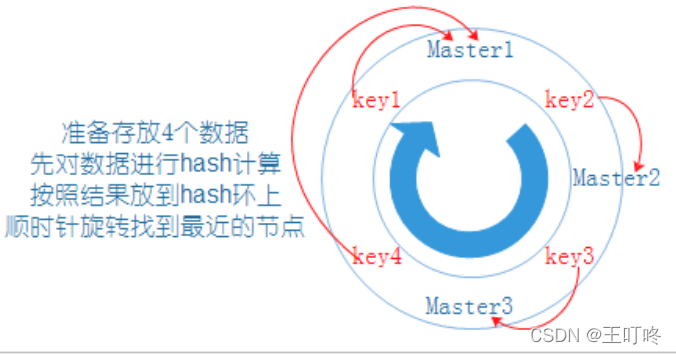

# redis

### 1. 压缩列表和调表


ziplist（压缩列表）：

* ***zlbytes***，记录整个压缩列表占用对内存字节数；
* ***zltail***，记录压缩列表「尾部」节点距离起始地址由多少字节，也就是列表尾的偏移量；
* ***zllen***，记录压缩列表包含的节点数量；
* ***zlend***，标记压缩列表的结束点，固定值 0xFF（十进制255）。

在压缩列表中，如果我们要查找定位第一个元素和最后一个元素，可以通过表头三个字段（zllen）的长度直接定位，复杂度是 O(1)。而**查找其他元素时，就没有这么高效了，只能逐个查找，此时的复杂度就是 O(N) 了，因此压缩列表不适合保存过多的元素**。


压缩列表节点包含三部分内容：

- ***prevlen***，记录了「前一个节点」的长度，目的是为了实现从后向前遍历；
- ***encoding***，记录了当前节点实际数据的「类型和长度」，类型主要有两种：字符串和整数。
- ***data***，记录了当前节点的实际数据，类型和长度都由 `encoding` 决定；

### 2. 如何保证缓存和数据库双写一致性

把cache和db的更新操作归在一个事务之下

* **写请求为什么更新数据库后是删除缓存而不是更新缓存**


注意看上面的图片，当有两个写请求的线程，线程一比线程二先执行，反而是线程二先执行完。这时候，缓存保存的是A的数据（老数据），数据库保存的是B的数据（新数据），数据**不一致**了。

* **写请求时，为什么更新数据库，然后再删除缓存？**


如果采用写请求，先删除缓存，再更新数据库就会出现如上图的情况，线程B读到的是老的数据，并且缓存中也保存的是老的数据。

* **写请求时，先更新数据，后删除缓存一定没问题吗？**


可以看到一个读请求和一个写请求，读请求可能会读取到旧的数据，或者当写请求删除缓存失败，读请求会一直读取的是旧的缓存数据。只不过是这种情况，相对于其他的实现方式概率要低很多。

#### 2.1 三种方案保证数据库与缓存的一致性

1. **缓存延时双删**



第二次删除缓存一般会采用延时的操作，主要是用来删除读请求产生的缓存数据

2. **删除缓存重试机制**

延时双删和普通写操作的删除操作都有可能会操作失败，导致数据不一致，删除重试机制就是为了保证删除可靠性。（删除失败的key放到消息队列中）这种机制会造成大量的业务代码入侵。

3. **读取biolog异步删除缓存**

通过binlog日志，将要删除的key发送到消息队列中。

### 3. 如何用redis实现异步队列和演示队列

#### 3.1 延时队列

将需要延时执行的任务放到 Redis 中的 Zset 类型中，Zset会根据 score 自动进行数据排序（score使用时间戳），定义一个延时任务检测器，检测器使用 zrangebysocre 命令查询 Redis 中符合执行条件的任务执行

#### 3.2 异步队列

Redis的队列list是有序的且可以重复的，作为消息队列使用时可使用rpush/lpush操作入队，使用lpop/rpop操作出队。当发布消息是执行lpush命令，将消息从列表左侧加入队列。消息接收方执行rpop命令从列表右侧弹出消息。

如果队列空了，消费者会陷入pop死循环，即使没有数据也不会停止。空轮询不但消耗消费者的CPU资源还会影响Redis的性能。并且需要不停的调用rpop查看列表中是否有待处理的消息。每调用一次都会发起一次连接，势必造成不必要的资源浪费。

入队的速度大于出队的速度，消息队列长度会一直增大，时间长了会占用大量的空间。

针对上面的 rpop 命令会一直阻塞队列，Redis提供了一种更优的 brpop命令，brpop可以设置一个超时时间


### 4. redis中的过期策略

三种方式：定时删除、定期删除、惰性删除

redis中采用的是 定期+惰性 删除

### 5. redis中的内存淘汰机制

**LRU 算法实现**：1.通过双向链表来实现，新数据插入到链表头部；2.每当缓存命中（即缓 存数据被访问），则将数据移到链表头部；3.当链表满的时候，将链表尾部的数据丢弃。

### 6. redis中的缓存击穿、缓存穿透、缓存雪崩

**缓存雪崩：**缓存同一时间大面积的失效，后面的请求都会落到数据库上，造成数据库短时间内承受大量的数据请求

    解决方案：缓存数据的过期时间随机设置，防止同一时间大量的数据过期的情况发生

**缓存穿透：**是指缓存和数据库中都没有数据，导致所有的请求都落到数据库上。数据库短时间承受大量的请求而崩掉

    缓存取不到，数据库也娶不到的数据， 设置为key—null 的方式
    布隆过滤器，将所有可能存在的数据哈希到一个足够大的bitmap 中去

**缓存击穿：** 高并发查询同一条数据，但是redis 中的数据过期了。导致请求发送到了数据库，造成缓存击穿

    解决方案： 设置热点数据永不过期；
    使用互斥锁。分布式情况下使用分布式的锁
### 7. redis中的多路I/O复用模型

#### 7.1 什么是多路I/O复用模型？

多路：多个socket连接，

复用：复用一个线程

多路I/O复用技术可以让单个线程高效的处理多个连接请求（尽量的减少网络IO的时间消耗）。

#### 7.2 Redis 为什么这么快？

Redis采用多路I/O复用模型，且完全基于内存操作。

### 8. redis中的持久化机制

Redis 中的持久化方式有两种，RDB全量持久化和[AOF](https://so.csdn.net/so/search?q=AOF&spm=1001.2101.3001.7020)增量持久化。一般情况下，Redis 中的RDB和AOF方式都需要开启。两者同时开启的情况下，默认使用 AOF方式。

#### 8.1 RDB和AOF

**RDB：**快照文件，不是实时更新的

RDB方式，Redis会是通过一个fork程来做持久化的工作。fork线程先将数据写入到一个临时文件中，写入成功之后，再替换掉之前的 RDB 文件，不会影响主线程的工作，所以这种方式对Redis的性能影响很小。

**AOF：**默认疫苗一次的后台线程fsync来把写操作写入AOF文件中

#### 8.2 **AOF的rewrite（重写）机制**

由于AOF是采用只追加的方式，这种方式会导致 AOF 文件越来越大，所以 Redis 为 AOF 提供了rewrite（重写）机制。

rewrite机制：当AOF文件大小超过所设定的阈值，redis就会启动AOF的文件内容压缩。

**工作原理：**在重写开始时，Redis 会创建一个 fork（重写子进程），这个fork进程会读取现有的 AOF 文件，将现有AOF文件中的指令压缩并写入到一个临时文件中。

在fork进程压缩写入临时文件的同时，主工作进程会将新接收到的写指令一边写入到内存缓冲区一边继续写入到原有的AOF文件中（保证原有AOF文件的可用性，防止重写时发生意外）

当fork进程重写完成后，会向主进程发送一个信号，主进程收到信号后，会将内存缓冲区中的写指令以追加的方式追加到临时文件中，当临时文件（新AOF文件）追加结束后，就会替换掉原有的AOF文件。之后再有新的写指令就会追加到新的AOF中了；
### 9. redis架构

#### 9.1 单机模式

风险大，出现故障丢失数据

#### 9.2 主从复制模式

一个master可以有多个slave节点，要给slave节点只能有要给master节点

master：写数据

slave：读数据

**优点：**

1. 读写分离（master写，slave读，提高服务器的读写负载）
2. 负载均衡（基于主从架构，配合读写分离，由slave分担master负载，改变slave的数量，通过多个从节点分担数据读取负载，提高Redis服务器并发量与数据吞吐量）
3. 故障恢复（当master出现问题，由slave提供服务，实现快速的故障恢复）
4. 数据冗余（实现数据热备份，是持久化之外的一种数据冗余方式）
5. 高可用的基石（基于主从复制，构建哨兵模式与集群，实现Redis的高可用方案）

#### 9.3 主从复制的三个阶段

1. 建立连接阶段工作流程（结果：master中保存slave的IP端口，slave保存master的IP端口，同时之间建立socket连接）

    1. 设置master的地址和端口，保存master信息
       1. slave节点：发送指令 slaveof ip port
       2. master节点：接收到指令，响应slave节点
       3. slave节点：保存master的IP和端口
    
    2. 建立socket连接（slave节点：根据保存的信息创建和master连接的socket）
    
    3. 发送ping命令
       1. slave 定时器发送ping指令（测试连接是否断开）
       2. master响应pong指令（回应slave连接未断开）
    
    4. 身份验证
       1. slave:发送指令 auth password （master设置密码，就需要进行权限校验）
       2. master 验证授权
       3. slave发送自己的端口给到master（master通过slave的端口实现监听）
       4. master保存slave的端口号
2. 数据同步阶段（结果：slave包含有master端的全部数据，master端保存有slave当前数据同步的位置）

    1. 请求同步数据（slave发送psync2指令）
    	redis 1.0 ：sync 指令
    	redis 2.8 ：psync 指令
    	redis 4.0 ：psync2 指令
    
        1. slave 发送 psync2 指令
        2. master执行bgsave指令，并且创建一个复制缓冲区
    
    2. 创建RDB文件同步数据
        1. master生成RDB文件，通过socket发送给slave
    
    3. 恢复RDB同步数据
        1. slave节点接收RDB文件，清空原有的slave数据，执行RDB文件恢复过程
    		上述的几个步骤统称为“全量复制”
      
    4. 请求部分同步数据
        1. slave发送命令告知RDB恢复已经完成
        2. master 发送复制缓冲区中的aof指令
    
    5. 恢复部分同步数据
        1. slave接收aof指令，执行 bgrewriteaof，恢复数据
    
    “全量复制”后的三步称之为 “增量复制”
3. 命令传播阶段（实时保证数据同步）

当master数据库状态被修改后，导致主从服务器数据库状态不一致，此时需要让主从数据同步到一致状态。master将接收到的数据变更命令发送给slave，slave接收命令后执行命令

命令传播阶段中的心跳机制

命令传播阶段，master和slave间的交换信息通过心跳机制进行维护，实现双方连接保持在线

    1. master：通过ping指令判断slave是否在线（周期由：repl-ping-slave-period 决定，默认10s）
    2. slave：通过 REPLCONF ACK {offset}指令判断master是否在线，并向master汇报slave自己的偏移量，获取最新的数据变更指令。（周期1s一次）

**服务器运行ID（runid）：** 每台服务器的唯一身份标识（同一个服务器每次运行都有不同的runid），40位字符组成，runid在服务器间传输被用作身份标识，master首次连接slave时，会将自己的runid发送给slave，slave保存runid。

**复制缓冲区：** 一个FIFO（先进先出）队列，用于存储服务器执行过的命令，每次传播命令，master都会将传播的命令记录下来，并保存在复制缓冲区。


**复制缓冲区的组成：**

1. 偏移量
2. 字节值

**复制缓冲区的内部工作原理：**

1. 通过offset区分不同的slave当前数据传播的差异
2. master记录已发送的信息对应的offset （master中会有多个slave节点的偏移量）
3. slave记录已接收的信息对应的offset（一个自己从master节点接收到的偏移量）

master 通过命令传播程序发送命令到slave节点时，可能会由于网络原因导致一部分slave节点没有接收到命令，通过复制缓冲区保存命令，并通过master节点和slave节点确认偏移量来保证数据的准确同步。
偏移量：同步信息，比对master和slave的差异，当slave断线后，恢复数据使用

**主从复制三阶段总结（数据同步阶段细节）：**

1. slave节点通过保存的master端口IP和master节点建立socket连接，连接成功之后。

2. slave发送指令

   ```
   psync2 ? -1
   # psync2 <runid> <offset>
   # slave 节点第一次连接不知道master节点的runid所以为？
   # -1 ：代表全部
   ```

3. master节点接收到指令后，执行bgsave 生成RDB文件，记录当前的复制偏移量 offset。并发送

   ```
   +FULLRESYNC runid offset
   # +FULLRESYNC：全量
   ```

   通过socket发送RDB文件给到slave（发送RDB文件期间offset可能会发生变化）

4. slave收到 +FULLRESYNC 保存master的runid和offset，清空当前全部数据，通过socket接收RDB文件，恢复RDB文件（2，3，4为全量复制的过程）

5. slave发送命令

6. master 接收命令，判断runid是否匹配，判定offset是否在复制缓冲区中

7. master判断如果 runid和offset有一个不满足，执行全量复制（回退到2节点）

8. master判断如果 runid和offset校验通过，master.offset 和 slave.offset 相同，忽略

9. master判断如果 runid和offset校验通过，master.offset 和 slave.offset 不相同，发送

10. slave 收到 +CONTINUE 保存master的offset，接收信息后，执行 bgwriteaof 恢复数据（5，6，7，8，9，10 为增量复制的过程）

11. slave发送心跳命令 replconf ack offset

12. master判断如果 offset 不满足，执行全量复制（回退到2节点）

13. master判断如果 offset校验通过，master.offset 和 slave.offset 相同，忽略

14. master判断如果 offset校验通过，master.offset 和 slave.offset 不相同，发送

15. slave 收到 +CONTINUE 保存master的offset，接收信息后，执行 bgwriteaof 恢复数据

**主从复制数据同步阶段需要注意的问题：**

1. 如果master数据量巨大，数据同步阶段应该避开流量高峰期，避免造成master阻塞，影响业务正常运行
2. 复制缓冲区大小设定不合理，会导致数据溢出（数据丢失）。如进行全量复制周期太长，进行部分复制时发现数据已经丢失的情况，则必须进行第二次全量复制，致使slave陷入死循环

3. 多个slave节点同时对master请求数据同步，master发送的RDB文件增多，会对带宽造成巨大冲击，如果master带宽不足，需要适当错峰

4. slave节点过多时，可以调整拓扑结构变为树状结构，中间的节点既是master又是slave节点（采用树状结构时，由于层级关系，导致深层次的slave节点与最顶层master数据同步延迟较大，数据一致性会变差）

**主从复制的配置：**

连接slave节点，在slave节点的redis.conf配置文件中添加一行配置

```
slaveof <masterip> <masterport>
# masterip：master的ip
# masterport：master的port
```

#### 9.4 哨兵模式

**Sentinel 的三大作用：**

监控（Monitoring）： Sentinel 会不断地检查(ping指令)你的主服务器和从服务器是否运作正常。
提醒（Notification）： 当个 Sentinel 监控 Redis服务器的状态，会在多个Sentinel之间进行数据共享
自动故障迁移（Automatic failover）： 当一个主服务器不能正常工作时，Sentinel会开始一次自动故障转移操作， 它会将失效主服务器的其中一个从服务器升级为新的主服务器， 并让失效主服务器的其他从服务器改为复制新的主服务器。
**Sentinel 原理：**

**主动下线**

概念：主观下线（Subjectively Down， 简称 SDOWN）指的是单个 Sentinel 实例对服务器做出的下线判断

如果一个 redis 服务器没有在 master-down-after-milliseconds 选项所指定的时间内， 对向它发送 PING 命令的 Sentinel 返回一个有效回复， 那么Sentinel 就会将这个服务器标记为主观下线

单个Sentine判断Redis服务器主观下线之后，会通过提醒（流言传播（Gossip））告知其他的Sentinel服务器，其他的Sentinel就来围观这台Redis服务器，超过半数的Sentinel认为Redis主管下线后，则该Redis服务器的状态变为客观下线。

**客观下线**

概念：多个 Sentinel 实例在对同一个服务器做出 SDOWN 判断， 并且通过SENTINEL is-master-down-by-addr 命令互相交流之后， 得出的服务器下线判断ODOWN。 （一个Sentinel 可以通过向另一个 Sentinel 发送命令来询问对方是否认为给定的服务器已下线）

客观下线条件只适用于主服务器，对于其他类型的 Redis 实例， Sentinel在将它们判断为下线前不不需要进行协商， 所以从服务器或者其他Sentinel 不会达到客观下线条件。 只要一个 Sentinel 发现某个主服务器进入了客观下线状态， 这个Sentinel就可能会被其他 Sentinel 推选出，并对失效的主服务器执行自动故障迁移操作。

### 10. redis-cluster 高可用集群

Redis Cluster内置集群，在Redis3.0才推出的实现方案。Redis Cluster是无中心节点的集群架构，依靠Gossip协议（谣言传播（PING-PONG机制））协同自动化修复集群的状态。节点的fail是通过集群中超过半数的节点检测失效时才生效。客户端与redis节点直连,不需要中间proxy层，客户端不需要连接集群所有节点。

**为什么需要三主三从？**

因为内部存在一个投票机制,节点的有效性是需要靠投票的,一个节点无法给自己投票,两个节点互相都连不上,A=>B,B=>A互相都说对方挂了没有定论.三个节点才能满足投票的需求

#### 10.1 集群的优点

1. 负载均衡（降低单台Redis服务器的访问压力）
2. 可拓展性（降低单台Redis服务器的存储压力）
3. 容灾处理

#### 10.2 redis-cluster 中的数据分布

Redis-Cluster中引入虚拟槽分区（哈希槽），共有16384（0~16383）个槽，这些槽平均分配到每个 master 上，在存储数据时利用 CRC16 （slot=CRC16（key）/16384 ）算法计算key属于哪个槽。每个master节点都会分配一定槽节点数量，并且其他节点存储的槽范围在节点上也是透明的（内部可知）
#### 10.3 redis-cluster的配置

需要修改redis.conf配置文件

```
cluster-enable yes  # 表示这个Redis 是一个cluster节点
cluster-config-file [filename.conf]  # cluster的配置文件
cluster-node-timeout 10000  # 节点服务超时时间，用于判定该节点是否下线或切换为从节点
```

cluster集群中各个redis一次启动完成后，需要使用

```
./redis-trib.rb create --replicas 1 ip1:port1 ip2:port2 ip3:port3 ip4:port4 ip5:port5 ip6:port6
# create 代表创建集群
# --replicas: 指定内部结构 1：代表一个master连接一个slave节点 ip1:port1->ip4:port4 ip2:port2->ip5:port5 ip3:port3->ip6:port6 
# 2： 代表一个master连接两个slave节点 ip1:port1->ip3:port3,ip4:port4  ip2:port2->ip5:port5,ip6:port6 
```

cluster集群搭建好之后，需要注意的是要使用redis-cli -c来连接cluster集群

#### 10.4 Cluster 的 slot 槽重新弄分配

redis-cluster 支持动态的新增和删除节点

#### 10.5 cluster存在的问题

集群内部采用Gossip协议（谣言传播）协同自动化修复集群的状态，但Gossip有消息延时和消息冗余的问题，在集群节点数量过多的时候，节点之间需要不断进行PING/PANG通讯，不必须要的流量占用了大量的网络资源。
Redis Cluster可以进行节点的动态扩容缩容，在扩缩容的时候，就需要进行数据迁移。而Redis 为了保证迁移的一致性， 迁移所有操作都是同步操作，执行迁移时，两端的 Redis 均会进入时长不等的 阻塞状态。对于小 Key，该时间可以忽略不计，但如果一旦 Key 的内存使用过大，严重的时候会接触发集群内的故障转移，造成不必要的切换
Gossip 的缺陷 - 消息的延迟 由于 Gossip 协议中，节点只会随机向少数几个节点发送消息，消息最终是通过多 个轮次的散播而到达全网的。 因此使用 Gossip 协议会造成不可避免的消息延迟。不适合用在对实时性要求较高 的场景下。 - 消息冗余 Gossip 协议规定，节点会定期随机选择周围节点发送消息，而收到消息的节点也 会重复该步骤。 因此存在消息重复发送给同一节点的情况，造成了消息的冗余，同时也增加了收到 消息的节点的处理压力。 而且，由于是定期发送而且不反馈，因此即使节点收到了消息，还是会反复收到重 复消息，加重了消息的冗余。
